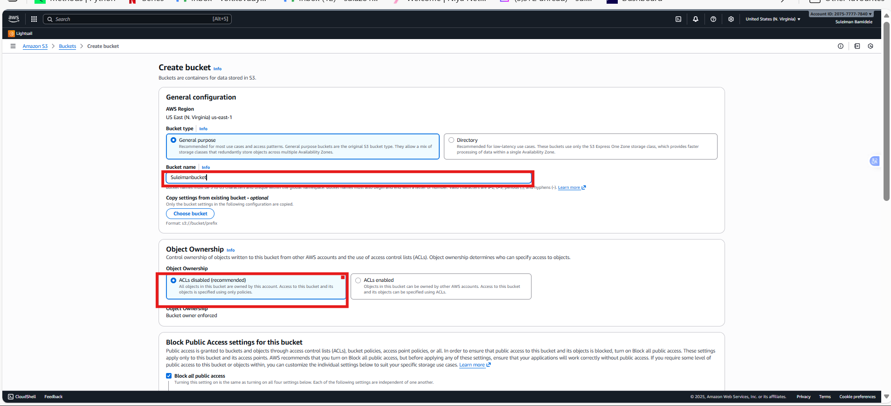
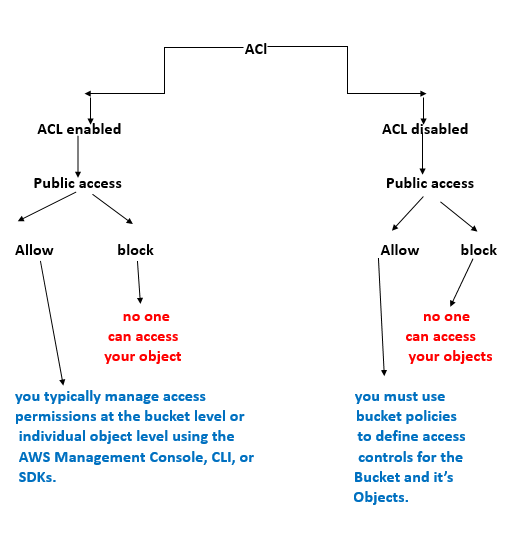
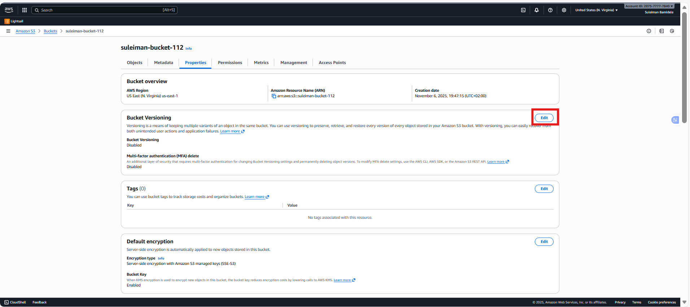
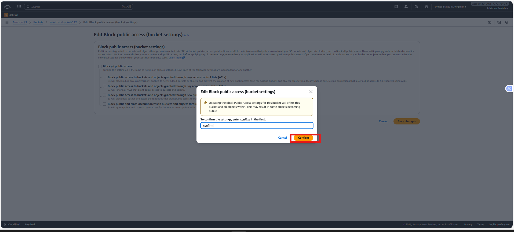

# AWS S3 Mini Project

During this session, we'll explore Amazon S3 (Simple Storage Service), a vital component of Amazon Web Services (AWS) for storing and accessing data. We'll cover key concepts like buckets, objects, versioning, and permissions, along with practical demonstrations on effectively managing our S3 resources.

But before we dive into Amazon S3 specifics, let's make sure we're familiar with cloud computing basics. If terms like "S3" or "object storage" are new to you, it's a good idea to review earlier materials to build a solid understanding of cloud concepts.

### Project Goals:

The primary goal of this project is to familiarize participants with Amazon S3 (Simple Storage Service) and its fundamental concepts. Participants will learn how to create and manage S3 buckets, upload objects, enable versioning, set permissions for public access, and implement lifecycle policies.

### Learning Outcomes:

By the end of this project, participants will have gained practical experience in working with Amazon S3 and will be able to:

Create and configure S3 buckets using the AWS Management Console.

Upload files and manage objects within S3 buckets.
Understand the importance of versioning and its implications for data management.

Configure permissions to control access to S3 objects.
Implement lifecycle policies to automate data management tasks and optimize storage costs.

### What is Amazon S3?

Amazon S3, or Simple Storage Service, is like a big digital warehouse where you can store all kinds of data. It's part of Amazon Web Services (AWS), which is a collection of cloud computing services.

Think of S3 as a giant virtual filing cabinet in the cloud. You can put files, documents, pictures, videos, or any other digital stuff you want to keep safe and accessible.

What's cool about S3 is that it's super reliable and secure. Your data is stored across multiple servers in different locations, so even if something goes wrong with one server, your files are still safe.

Plus, S3 is really flexible. You can easily access your files from anywhere in the world using the internet, and you can control who gets to see or edit your stuff with different levels of permissions.

### S3 Benefits

Amazon S3 offers a range of benefits that make it a top choice for storing and managing data in the cloud.

Firstly, S3 provides exceptional durability and reliability. Your data is stored across multiple servers and data centers, ensuring that even if one server fails, your files remain safe and accessible.

Secondly, S3 offers scalability, meaning you can easily increase or decrease your storage capacity as needed. Whether you're storing a few gigabytes or petabytes of data, S3 can handle it without any hassle.

Another key benefit of S3 is its accessibility. You can access your data from anywhere in the world using the internet, making it convenient for remote teams or distributed applications.

Security is also a top priority with S3. You have full control over who can access your data and can encrypt your files to ensure they remain confidential and secure.

Additionally, S3 is cost-effective. You only pay for the storage you use, with no upfront fees or long-term contracts, making it a budget-friendly option for businesses of all sizes.

### S3 Use Cases

Backup: Think of it as a safe place to keep copies of important files, like your computer's backup. If anything happens to your computer, you can get your files back from S3.

Website Stuff: S3 can also hold all the pieces of a website, like images and videos. So, when you visit a website, some of the stuff you see might be stored in S3.

Videos and Photos: You know all those videos and photos you share online? They're often stored in S3 because it's really good at keeping them safe and making sure they load fast.

Apps and Games: S3 is also used by apps and games to store things like user profiles or game levels. It helps keep everything running smoothly and makes sure your progress is saved.

Big Data: Companies use S3 to store huge amounts of data for things like analyzing customer behavior or trends. It's like having a big library where you can find all sorts of useful information.

Emergency Backup: Some companies use S3 to store copies of their data in case something bad happens, like a natural disaster. It's like having a backup plan to keep things going no matter what. Keeping Old Stuff: Sometimes, companies have to keep old records for legal reasons. S3 has special storage options that are really cheap, so it's a good place to keep all that old stuff without spending too much money.

Sending Stuff Fast: S3 works with a service called CloudFront, which helps deliver stuff really quickly to people all over the world. So, if you're watching a video or downloading a file, S3 helps make sure it gets to you fast.

### S3 Core Concepts

Buckets: Think of buckets as folders where you can store your files. Each bucket has a unique name and can hold an unlimited number of objects (files).

Objects: Objects are the individual files you store in S3, like photos, videos, documents, or any other type of data. Each object has a unique key (file name) and can range in size from a few bytes to terabytes.

Keys: Keys are unique identifiers for objects within a bucket. They're like the file names you use on your computer. You can organize objects within a bucket using folder-like structures in their keys, called prefixes.

Storage Classes: S3 offers different storage classes to suit various use cases and budget requirements. These include Standard, Standard-IA (Infrequent Access), One Zone-IA, Intelligent-Tiering, Glacier, and Glacier Deep Archive. Each class has different durability, availability, and cost characteristics.

Access Control: You can control who can access your objects in S3 using Access Control Lists (ACLs) and Bucket Policies. You can also use Identity and Access Management (IAM) to manage access at a user or group level.

Durability and Availability: S3 is designed for 99.999999999% (11 nines) durability, meaning your data is highly resistant to loss. It also offers high availability, ensuring that your objects are accessible whenever you need them.

Data Transfer: S3 supports both inbound (upload) and outbound (download) data transfer. You can transfer data to and from S3 using various methods, including the AWS Management Console, CLI (Command Line Interface), SDKs (Software Development Kits), or third-party tools.

Versioning: S3 Versioning allows you to keep multiple versions of an object in the same bucket. This feature helps protect against accidental deletion or overwrite, as you can restore previous versions of an object if needed.

#### Note-

Storage class- A storage class in Amazon S3 is like a category or type of storage option for your data. Each storage class has its own set of characteristics, such as cost, durability, and availability, that determine how your data is stored and managed in the cloud. You can choose the storage class that best fits your needs based on factors like how frequently you access your data, how quickly you need it, and how much you're willing to pay for storage.

AWS Management Console: It's a website where you can manage all your AWS services using a point-and-click interface. You can do things like starting virtual servers, storing files, and setting up security rules, all without needing to write any code.

CLI (Command Line Interface): This is a tool that lets you control AWS services using text commands typed into a terminal or command prompt. It's handy for automating tasks and scripting repetitive actions.

SDKs (Software Development Kits): SDKs are packages of tools and code that help developers build applications that use AWS services. They provide ready-made functions and examples to make it easier to integrate AWS into your software projects, whether you're coding in Java, Python, JavaScript, or another language.

### What is S3 Versioning?

Imagine you're working on a big project and you accidentally delete an important file. But wait, with S3 versioning, it's like having a magic undo button.

Here's how it works: Normally, when you delete a file in S3, it's gone for good. But with versioning turned on, S3 keeps a copy of every version of your file, even if you delete it or overwrite it. So if you make a mistake, you can easily go back to a previous version and restore it, just like rewinding time.

This feature is super handy for protecting your data from accidents or malicious actions. It's like having a safety net for your files, ensuring that even if something goes wrong, you can always recover your precious data. Plus, it's easy to turn on and manage, giving you peace of mind knowing that your files are always safe and sound in Amazon S3.

Breaking it down into five parts so that it will help us understand it more clearly.

Firstly, we will create a new bucket in Amazon S3 to store our files. Following that, we will upload a file into this newly created bucket. Subsequently, we will enable versioning for the bucket, allowing us to retain multiple versions of our uploaded files for tracking changes over time. Next, we will configure the permissions for the bucket to enable public access, ensuring that the files can be accessed by anyone with the appropriate link. Finally, we will implement lifecycle policies to automate the management of our files.

Let's initiate the practical phase by setting up the creation of an Amazon S3 bucket.

1. First, navigate to the search bar on the AWS console.

a) search for "S3".

2. After clicking on S3 in the search results, you'll be directed to the S3 page.

a) From there, locate and click on the "Create bucket" button.

3. Let's proceed with creating a new bucket. Please provide a unique name for the bucket, ensuring it's distinct from any existing bucket names.

a) Select "ACL Disabled" for object ownership.

b) Ensure to check the "Block all public access" option.

c) Additionally, leave Bucket Versioning disabled.

d) Proceed with the default settings.

e) Once done, click on the "Create bucket" button to finalize the creation process.

Note- ACL, or Access Control List, is like a set of rules that decides who can access your stuff in Amazon S3. You can use ACL to grant or deny access to your buckets and files for specific AWS accounts or predefined groups of users. It's a way to control who gets to see or mess with your data in the cloud.

If you encounter below error message, consider changing the name and then proceeding again.

For further details on naming conventions, please refer to the documentation Bucket naming rules.https://docs.aws.amazon.com/AmazonS3/latest/userguide/bucketnamingrules.html

Our bucket has been successfully created, and currently, there are no objects stored within it.

Now, let's move on to the second part, where we'll upload an object into the bucket named 'suleiman-bucket-112'.

1. Let's create a file on our laptop with some data. We'll write 'Welcome to the AWS world' and save the file.

2. Next, click on the "Upload" button.

3. Click on "Add file" and select the file you've created.

a) Once selected, click "Open"

4. You'll then see the file being added.

a) Finally, click "Upload" to complete the process.

File successfully uploaded to our object (file) to the S3 bucket (folder).

Let's move on to the next step, which involves enabling versioning.

1. In the bucket's Properties section on the right side, you'll notice that bucket versioning is currently disabled.

So now we’ll enable it.

2. Click on edit

3. Select "Enable".

a) Then click on "Save changes" to enable versioning for the bucket.

4. Now, lets you modify the content of the file and upload it again, you'll create a new version of the file.

a) By clicking on "Show versions," you'll be able to see all the versions of the file you've uploaded.

b) Now, whenever we make changes to the file and upload it again to the same bucket, it will continue creating versions of that file for future reference.

If you want to view the content of both versions, let's proceed to our next step, which involves setting permissions.

1. Now, in the permissions section of the bucket, you'll notice that "Block all public access" is enabled.

a) Click on "Edit" to make changes.

2. Now, uncheck the "Block all public access" option.

a) Then click on "Save changes"

b) Now, type "confirm" and click on "Confirm".

By taking this action, you are allowing your file to be publicly accessible. This confirmation step ensures that you are aware of the implications of making your file public.

3. Now, you need to create a bucket policy to specify the actions you want the public to be able to perform on your file. Click on 'Edit'.

4. Now, click on the "Policy generator".

5. Now, select the "Type of Policy" as "S3 Bucket Policy"

a) Set the "Effect" to "Allow",

b) specify the "Principal" as "*", which means all users.

c) Choose the action "Get object “ and "Get object version",

d) In the field of Amazon Resource Name (ARN), type the ARN of your bucket and add by “/*” after the ARN. Then,

e) click on "Add statement".

My Actual ARN is - arn:aws:s3:::suleiman-bucket-112

And we need to add /* arn:aws:s3:::suleiman-bucket-112/*

f) Copy the ARN from here.

Note- ARN stands for Amazon Resource Name. It's like a unique address for every resource in AWS, such as buckets in S3. Just like your home address tells people where you live, an ARN tells AWS where a specific resource is located. It helps AWS know exactly which resource you're referring to when you're setting up permissions or policies.

6. Now click on “generate policy”

a) Now, copy this and click on "Close".

"Id": "Policy1714394236530": This line specifies the unique identifier for the policy. The ID is used for reference and can be helpful for managing policies within AWS.

"Version": "2012-10-17": This line indicates the version of the policy language being used. In this case, it's using version "2012-10-17" of the policy language.

"Statement": [...]: This line begins the definition of the policy's statements. Policies can have multiple statements, each defining a set of permissions.

"Sid": "Statement1": This line assigns a unique identifier to the statement. Similar to the policy ID, the statement ID is used for reference and management purposes.

"Action": ["s3:GetObject", "s3:GetObjectVersion"]: This line specifies the actions allowed by this policy. In this case, it allows the s3:GetObject and s3:GetObjectVersion actions, which are used to retrieve objects and object versions from an S3 bucket.

"Effect": "Allow": This line specifies the effect of the statement, which can be either "Allow" or "Deny." Here, it indicates that the actions specified in the Action field are allowed.

"Resource": "arn:aws:s3:::akinwalebucket/": This line specifies the AWS resource to which the policy applies. In this case, it applies to all objects (/) within the S3 bucket named my-first-s3-bucket-090. The ARN (Amazon Resource Name) uniquely identifies the resource.

"Principal": "*": This line specifies the entity to which the policy applies. The * wildcard means that the policy applies to all users and roles (i.e., any principal) in the AWS account.

b) Navigate to the bucket policy tab.

c) Paste the policy you've created using the Policy Generator.

7. Click on “Save changes”

8. Now, click on this version of your file.

9. Click on the object URL.

Here we’ll see the previous data.

Lets click to the latest version

And click on the object URL,

we’ll get the latest data.

Now, let's proceed to the next step, which involves creating lifecycle policies.

1. For this, let's navigate to the management section of the bucket.
a) click on "Add lifecycle rule".

2. Give the specifications, and click to create rule.

Now the lifecycle policy is being created successfully.

This rule is set up to automatically move files from one type of storage to another in our Amazon S3 bucket. Specifically, it moves files to a storage type called Standard-IA after they've been sitting in our bucket for 30 days. This helps you save money because Standard-IA storage is cheaper than the default storage option. So, if you have files that you don't access very often but still want to keep, this rule helps you save costs by storing them in a cheaper storage class after a certain period of time.

For more information about storage classes, you can go through Amazon S3 Storage Classes. And about storage lifecycle, you can go through Managing your storage lifecycle.

### Project Reflection:

I have gained hands-on experience with Amazon S3, a core service of AWS.

I Managed S3 buckets and objects, learning key concepts like versioning, permissions management, and lifecycle policies.

Through practical tasks, I developed a solid understanding of S3 features.

I learned to optimize storage costs and ensure data reliability and accessibility using AWS features.

This project equipped me with valuable skills applicable to real-world scenarios.

End.

