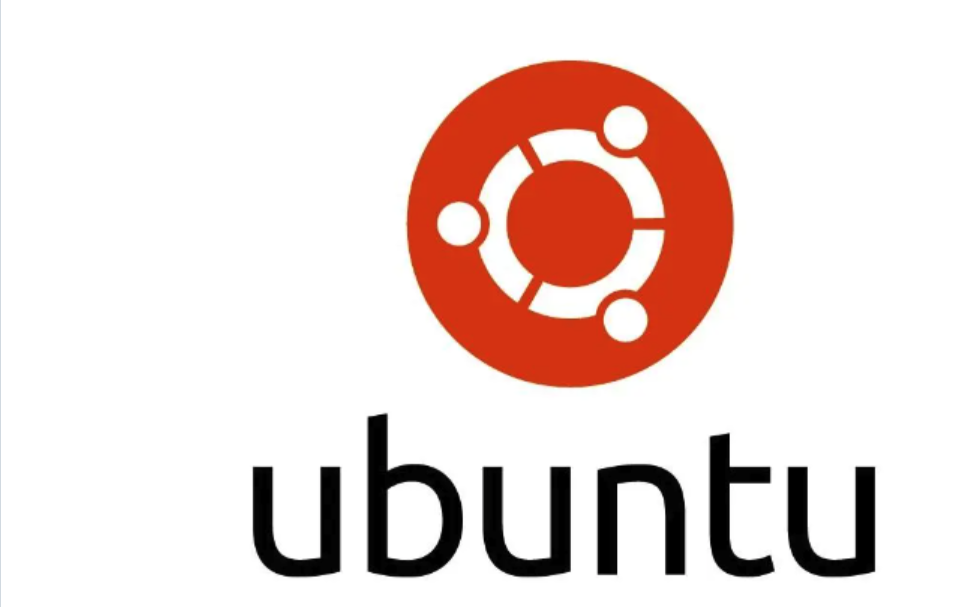
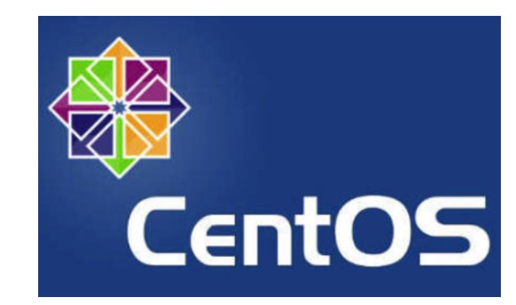

# Mini Project - Linux Fundamentals

### Introduction to Linux

In the dynamic landscape of technology, mastering the fundamentals is essential for anyone aspiring to excel in fields such as DevOps, Cloud Computing, Software Development, Cybersecurity, Data Analysis/Science, AI, and QA Testing. This project is designed to equip you with a solid foundation in Linux. Understanding the tech from the basics lays the groundwork for success in various tech-centric careers.

### What is Linux?

Linux is a free, open-source operating system similar to Windows or macOS, but it's more widely used for servers and supercomputers. It's known for its stability, security, and flexibility, allowing users to modify and distribute their versions. Linux runs on a wide range of devices, from desktops to smartphones, and powers much of the internet's infrastructure. It's supported by a global community of developers who contribute to its many distributions, each tailored for specific needs or preferences.

### Linux Distribution

Linux distributions, often referred to as distros, are different flavours of the Linux operating systems built using the Linux kernel. These distros package the Linux kernel with a range of software, libraries, and tools to provide a functional computing environment. They offer different configurations, desktop environments, package managers, and software repositories, and then they are branded. Some of the Linux distributions are;

Ubuntu: Ubuntu is one of the most widely recognized Linux distributions, known for its user-friendliness and ease of installation. It's an excellent choice for those new to Linux, as well as for everyday desktop computing. Ubuntu has server editions for web hosting and cloud deployments.

CentOS: CentOS is favored in enterprise and server environments due to its stability and long-term support. It is essentially a free and open-source version of Red Hat Enterprise Linux (RHEL) which is another distro itself, but requires paid license. System administrators often choose CentOS because its free, reliability and robust.

Debian: Debian is also known for its commitment to free and open-source software principles. Makes Linux available for free, provides a wide range of software packages and supports multiple hardware architectures.

Fedora: Fedora is a cutting-edge distribution that focuses on integrating the latest software and technologies. It's a great choice for those who want to experiment with new features and applications. Fedora also serves as a testing ground for Red Hat's Enterprise Linux products.

### Installation and Initial Setup

In this section, I will create a server in the cloud, and gain access to it from my local environment. When I say "Local environment" I'm referring to my laptop, or the desktop PC I'm using to work. Which would have either Windows, or Mac operating system in most cases. I will connect to that server in the cloud, remotely straight from my laptop.

The setup will look like this.

### Let us create an EC2 instance. i.e a Linux Server

i. Register a new AWS account following this instruction

ii. Sign in to your AWS account

iii. On the top left select services and search for Elastic Cloud Compute (EC2).

iV. From the menu on the left side, select instances.

v. Select launch instance on the top right side.

vi. Follow the image below to finish lauching an instance.

### Connecting using SSH, I use MobaXterm

I will open my MobaXterm application on my PC and connect to my remote server using SSH.

I will copy the pulic IP address for my instance and input Ubuntu as my user name, go to the advance section and and locate private key, change the directory to where my pem key is located which is in download folder.

Once you establish a successful connection, you should see an output like the below which proves that you have successfully connected to your remote server

### Package Managers

Most of the time, when working on linux, there will be the need to install tools. Lets think about it, the servers are used to host websites, and there has to be a tool that will help in the rendering of the web ages. A commonly used tool is called "Nginx".

Since the servers are not our regular computers where we can go to a browser to click and download, there is the need to have package managers that can help achieve this.

Package managers in Linux are tools that automate the process of installing, updating, configuring, and removing software packages on a Linux server. They simplify the management of software by handling dependencies, versioning, and installation procedures. There are several package managers used in various Linux distributions.

Commonly Used Package Managers APT (Advanced Package Tool): Used by Debian-based distributions such as Debian, Ubuntu, and derivatives. Commands include apt-get and apt.

YUM (Yellowdog Updater Modified): Originally used by Red Hat and CentOS,YUM is now largely replaced by dnf in modern Red Hat-based distributions. It simplifies package management by resolving dependencies just like apt.

DNF (Dandified YUM): Used in modern versions of Red Hat-based distributions as a replacement for YUM. It provides improved performance and resolves some of the limitations of the older YUM tool.

### Installing, Updating and Removing Software

Since we are already on an Ubuntu based server, lets explore how to install tools on a linux server.

Updating Package Lists Before installing new software or updating existing packages, it's important to refresh the package lists.

Command sudo apt update # For Debian/Ubuntu-Based System

Command yum update # For Red Hat/Fedora-based systems.

Sudo is to give administartive previlages to a user.

Installing Software Packages

Lets try to install a command called tree

The tree command is commonly used to visually see the file system structure on a linux server. So let's install it with the command below.

Debian/Ubuntu

sudo apt install tree

If we are on other other Linux distribution using yum, the command would look like this.

Red Hat/Fedora

sudo yum install tree

Verifying Installed Packages To confirm that the desired package or software has been successfully installed, simply run the tree command, and specify the path you want to see the tree structure.

Updating Installed Packages Keep your system up-to-date by updating installed packages.

sudo apt upgrade

Removing Software Package To remove the tree package we installed earlier, run the below command

sudo apt remove tree

In the next step, we would be engaging in more hands on project that involve using commands on a Linux system. Working with Linux commands typically includes tasks such as navigating the file system, managing files and directories and manipulating permissions.