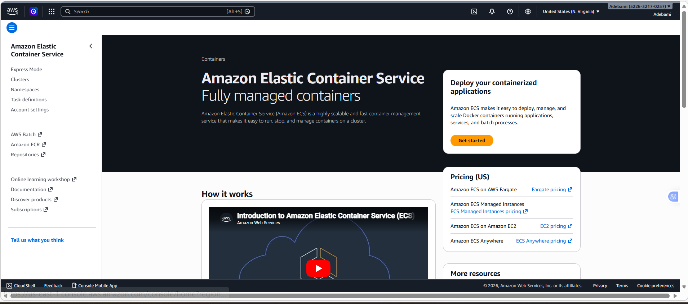

# E-Commerce with GitHub Actions

## Capstone Project: E-Commerce Application CI/CD Pipeline

### Project Overview: Automated Pipeline for an E-Commerce Platform

#### Hypothetical Use Case:

You are tasked with developing and maintaining an e-commerce platform. This platform has two primary components:

E-Commerce API: Backend service handling product listings, user accounts, and order processing.

E-Commerce Frontend: A web application for users to browse products, manage their accounts, and place orders.

The goal is to automate the integration and deployment process for both components using GitHub Actions, ensuring continuous delivery and integration.

### Project Tasks:

#### Task 1: Project Setup

Create a new GitHub repository named ecommerce-platform.

1. ##### Create the GitHub repository

On GitHub:

. Click New Repository

. Name it ecommerce-platform

. Choose Public or Private

. (Optional) Add a README and a Node .gitignore

2. ##### Clone the repository to your machine

git clone https://github.com/<your-username>/ecommerce-platform.git
cd ecommerce-platform

Inside the repository, create two directories: api for the backend and webapp for the frontend.

3. ##### Create the required directories

mkdir api-backend

mkdir webapp-backend

4. ##### Commit the initial structure

git add .
git commit -m "Initial project setup with api and webapp directories"
git push origin main

#### Task 2: Initialize GitHub Actions

Initialize a Git repository and add your initial project structure.

1. Move into your project folder:

cd ecommerce-platform

2. Initialize Git (if not already initialized):

git init

3. Add the backend and frontend directories created in Task 1:

mkdir -p api webapp

4. Add a placeholder file so Git tracks the empty folders:

echo "# API service" > api/README.md
echo "# Webapp service" > webapp/README.md

5. Stage and commit the initial structure:

git add .
git commit -m "Initial project structure with api and webapp directories"

6. Connect to the GitHub repository (if not already connected):

git remote add origin https://github.com/<your-username>/ecommerce-platform.git
git branch -M main
git push -u origin main

##### Create .github/workflows directory in your repository for GitHub Actions.

1. Create the directory:

mkdir -p .github/workflows

2. Add a placeholder file so Git tracks the folder:

echo "# GitHub Actions workflows will be added here" > .github/workflows/README.md

3. Commit the workflow directory:

git add .
git commit -m "Add GitHub Actions workflows directory"
git push

#### Task 3: Backend API Setup

In the api directory, set up a simple Node.js/Express application that handles basic e-commerce operations.

Implement unit tests for your API.

##### Creating the Node.js/Express API

1. Initialize the backend project
Inside the api directory:

cd api
npm init -y
npm install express
npm install --save-dev jest supertest

2. Create the backend folder structure
Inside api-backend/, create the required directories:

mkdir -p src/routes tests

3. Add the backend application code
src/app.js

4. src/server.js

5. Add simple route handlers
src/routes/products.js

6. src/routes/users.js

7. src/routes/orders.js

8. Add unit tests
tests/products.test.js

9. tests/users.test.js

10. tests/orders.test.js

11. ##### Update your package.json test script

Open package.json and replace the test script:

12. ##### Run and verify

Run tests:

npm test

#### Task 4: Frontend Web Application Setup

In the webapp directory, create a simple React application that interacts with the backend API.

Ensure the frontend has basic features like product listing, user login, and order placement.

1. ##### Creating the React application

Move into your frontend directory:

cd webapp-frontend

Create a Vite React project:

npm create vite@latest . --template react
npm install

2. ##### Connecting the frontend to the backend API
The backend runs on port 3000, so create a simple API helper.

Create src/api.js

This file centralizes all API calls so your components stay clean.

3. ##### Create the Product List component
Create:

src/components/ProductList.jsx

4. ##### Create the Login component
Create:

src/components/Login.jsx

5. ##### Create the Order Form component
Create:

src/components/OrderForm.jsx

6. ##### Combine everything in App.jsx
Open:

src/App.jsx
Replace its content with:

7. ##### Run the frontend
Start your backend:

npm start

Then start your frontend:

npm run dev

Open:

http://localhost:5173

#### Task 5: Continuous Integration Workflow

Write a GitHub Actions workflow for the backend and frontend that:
Installs dependencies.

Runs tests.

Builds the application.

1. ##### Create the .github/workflows directory
Run these commands from project root:

mkdir -p .github/workflows

You can verify it was created:

ls .github

You should see:

workflows

2. ##### Create the backend workflow file
Create the backend CI workflow:

nano/vi .github/workflows/api-ci.yml

3. ##### Create the frontend workflow file
Create the frontend CI workflow:

nano/vi .github/workflows/webapp-ci.yml

Paste this:

4. ##### Commit and push your workflows
Run:

git add .github/workflows
git commit -m "Add CI workflows for backend and frontend"
git push

Then go to:

👉 GitHub → Your Repository → Actions

You’ll see both workflows appear and run automatically.

#### Task 6: Docker Integration

Create Dockerfiles for both the backend and frontend.

Modify your GitHub Actions workflows to build Docker images.

##### Step 1 — Create Dockerfile for the Backend
Navigate to:

ecommerce-platform/api-backend/

Create a file named:

Dockerfile

Paste this inside:

[Dockerfile](./img/Dockerfile.png)

##### Step 2 — Create Dockerfile for the Frontend
Navigate to:

ecommerce-platform/webapp-frontend/

Create:

Dockerfile

Paste this:

##### Step 3 — Add .dockerignore files
This keeps your images clean and small.

Backend .dockerignore

#### step 4 - Navigate to the backend folder:

cd ecommerce-platform/api-backend

Create the .dockerignore file:

nano/vi .dockerignore

Paste this inside:

##### Create the frontend .dockerignore
1. Navigate to the frontend folder:

cd ecommerce-platform/webapp-frontend

2. Create the .dockerignore file:

nano/vi .dockerignore

3. Paste this inside:

##### Step 4 — Build & Run Your Backend Docker Image
1. Move into your backend folder:

cd /ecommerce-platform/api-backend

2. Build the Docker image:

docker build -t ecommerce-backend .

3. Run the backend container:

docker run -p 5000:5000 ecommerce-backend

Now open your browser and visit:

http://localhost:5000

If your backend prints logs or responds to requests, it’s working beautifully.

##### Run the Frontend Docker Container
Now move into your frontend folder:

cd ecommerce-platform/webapp-frontend

1. Build the frontend image

docker build -t ecommerce-frontend .

2. Run the frontend container

docker run -p 80:80 ecommerce-frontend

Then open your browser and visit:

http://localhost

You should see your frontend UI loading from inside Docker.

#### Task 7: Deploy to Cloud

Choose a cloud platform for deployment (AWS, Azure, or GCP).

Configure GitHub Actions to deploy the Docker images to the chosen cloud platform.

Use GitHub Secrets to securely store and access cloud credentials.

Since i am already on AWS, I will be building deployment pipeline around Amazon ECS (Fargate) and Amazon ECR, which is the most production‑ready way to deploy Docker containers on AWS.

##### STEP 1 — Create AWS Credentials for GitHub Actions

1. Go to AWS Console → IAM
2. Create a new user:
Name: github-actions-deployer
3. Assign permissions:
Attach this policy:

AmazonEC2ContainerRegistryFullAccess
AmazonECS_FullAccess

4. Create access keys
Copy:

AWS_ACCESS_KEY_ID

AWS_SECRET_ACCESS_KEY

##### STEP 2 — Add GitHub Secrets
Go to:

GitHub → Your Repo → Settings → Secrets → Actions

Add these secrets:

These secrets allow GitHub Actions to authenticate with AWS.

##### STEP 3 — Create ECR Repositories
In AWS Console → ECR → Create Repository:

ecommerce-backend

ecommerce-frontend

These will store your Docker images.

These will store the Docker images.

##### STEP 4 — Update GitHub Actions to Build & Push Docker Images to ECR
You will add these steps to your existing CI workflows.

cd .github/workflows

##### Update the Frontend Workflow (webapp-ci.yml)
Just like we did for the backend, we will edit the frontend workflow located at:

ecommerce-platform/.github/workflows/webapp-ci.yml

Navigate to the file:

cd workflows

vi webapp-ci.yml

##### Create ECS Cluster
Go to AWS Console → ECS

Click Create Cluster

Choose Networking only (Fargate)

Name it:
ecommerce-cluster

Create

##### Create Task Definitions
You need two task definitions:

1️⃣ Backend Task Definition
Name: ecommerce-backend-task

Launch type: Fargate

Container:

Image: <AWS_ACCOUNT_ID>.dkr.ecr.<AWS_REGION>.amazonaws.com/ecommerce-backend:latest

Port: 5000

Memory: 512 MiB

CPU: 256

2️⃣ Frontend Task Definition
Name: ecommerce-frontend-task

Launch type: Fargate

Container:

Image: <AWS_ACCOUNT_ID>.dkr.ecr.<AWS_REGION>.amazonaws.com/ecommerce-frontend:latest

<AWS_ACCOUNT_ID>.dkr.ecr.<AWS_REGION>.amazonaws.com/ecommerce-frontend:latest
Port: 80

Memory: 512 MiB

CPU: 256

##### Create Your ECS Services
We will create two services, one for the backend and one for the frontend.
Both will run inside ECS cluster using the task definitions we just created.

Backend Service (API)
1. Go to:
ECS → Clusters → ecommerce-cluster

2. Click:
Create → Create service

3. Configure the service:
Launch type: Fargate

Task definition:  
ecommerce-backend-task:1 (or latest revision)

Service name:  
ecommerce-backend-service

Desired tasks:  
1

4. Networking:
VPC: choose your default VPC

Subnets: select all available

Auto-assign public IP: ENABLED

Security group:  
Create or choose one that allows inbound traffic on port 5000

5. Load balancer:
You can skip this for now (optional).

6. Click Create service
Your backend will now deploy.

##### Frontend Service (Web App)
Repeat the same steps:

1. ECS → ecommerce-cluster → Create service
2. Service settings:
Task definition:  
ecommerce-frontend-task:1

Service name:  
ecommerce-frontend-service

Desired tasks:  
1

3. Networking:
Public IP: ENABLED

Security group:  
Allow inbound traffic on port 80

4. Create service
Your frontend will now deploy

### Task 8: Continuous Deployment

Configure your workflows to deploy updates automatically to the cloud environment when changes are pushed to the main branch.

#### Continuous Deployment (CD) with AWS App Runner

App Runner automatically redeploys service every time GitHub Actions workflow pushes a new image to ECR.
That means the CI pipeline is already doing 80% of the work — we just need to connect the final piece.

##### Step 1: CI pipeline is already correct

GitHub Actions workflow:

Builds the backend image

Tags it

Pushes it to ECR

Runs automatically on every push to main as CD requires. So there is no need to modify workflow anymore.

##### Step 2: Create an App Runner service connected to your ECR repo

Go to AWS Console → App Runner

Click Create service.

Choose:

##### Deployment source:

Container registry

Provider: Amazon ECR

Repository: backend-api

Tag: latest

##### Deployment settings:

Automatic deployment: ON  

##### Service settings:

CPU: 1 vCPU

Memory: 2 GB

Port: 3000 (or whatever your backend uses)

##### Security:

Create or use an existing IAM role

App Runner will automatically pull from ECR

Click Create & Deploy.

App Runner will:

Pull your image

Start your backend

Give you a public HTTPS URL

Automatically redeploy on every new image push

This is full Continuous Deployment.

##### STEP 1 — Create an ECS Cluster
Go to:

AWS Console → ECS → Create Cluster

Choose:

Cluster template: Networking only (Fargate)

Cluster name: backend-cluster

Click Create.

##### STEP 2 — Create a Task Definition
Go to:

ECS → Task Definitions → Create new Task Definition

Choose:

Launch type: Fargate

Task family: backend-task

CPU: 0.5 vCPU

Memory: 1 GB

Add Container:

Container name: backend

Image:

<your-account-id>.dkr.ecr.<region>.amazonaws.com/backend-api:latest

Port mappings:

Container port: 3000

Environment variables (if needed)
Add your backend config here.

Click Create.

##### STEP 3 — Create a Fargate Service
Go to:

ECS → Clusters → backend-cluster → Create Service

Choose:

Launch type: Fargate

Task definition: backend-task

Service name: backend-service

Desired tasks: 1

Networking:
VPC: default

Subnets: select all

Security group:

Allow inbound 3000 (or your backend port)

Allow outbound 0.0.0.0/0

Load Balancer (optional but recommended)
If you want HTTPS + domain later:

Choose Application Load Balancer

Create new target group

Map port 3000

Click Create Service.

Your backend is now running on ECS Fargate.

##### STEP 4 — Connect CI/CD to ECS (Automatic Deployment)
GitHub Actions workflow already pushes images to ECR.
We now add one final step to update the ECS service automatically.

Add this to the end of workflow:

This step:

Updates the task definition with the new image

Triggers ECS to redeploy

Waits until the service is stable

### Conclusion

This capstone project aims to provide hands-on experience in automating CI/CD pipelines for a real-world e-commerce application, encompassing aspects like backend API management, frontend web development, Docker containerization, and cloud deployment.

End.