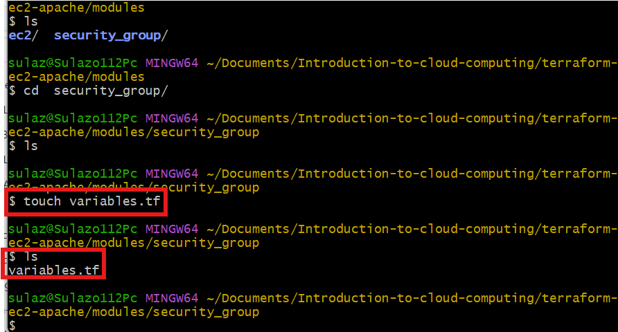

# EC2 Module and Security Group Module with Apache2 UserData.

## Mini Project: EC2 Module and Security Group Module with Apache2 UserData

### Purpose:

In this mini project, we will use Terraform to create modularized configurations for deploying an EC2 instance with a specified Security Group and Apache2 installed using UserData.

### Objectives:

1. Terraform Module Creation:

Learn how to create Terraform modules for modular infrastructure provisioning.

2. EC2 Instance Configuration:

Configure Terraform to create an EC2 instance.

3. Security Group Configuration:

Create a separate module for the Security Group associated with the EC2 instance.

4. UserData Script:

Utilize UserData to install and configure Apache2 on the EC2 instance.

### Project Tasks:

#### Task 1: EC2 Module

1. Create a new directory for your Terraform project (e.g., terraform-ec2-apache).

2. Inside the project directory, create a directory for the EC2 module (e.g., modules/ec2).

3. Write a Terraform module (modules/ec2/main.tf) to create an EC2 instance.

#### Task 2: Security Group Module

1. Inside the project directory, create a directory for the Security Group module (e.g., modules/security_group).

2. Write a Terraform module (modules/security_group/main.tf) to create a Security Group for the EC2 instance.

#### Task 3: UserData Script

1. Write a UserData script to install and configure Apache2 on the EC2 instance. Save it as a separate file (e.g., apache_userdata.sh).

2. Ensure that the UserData script is executable (chmod +x apache_userdata.sh).

#### Task 4: Main Terraform Configuration

1. Create the main Terraform configuration file (main.tf) in the project directory.

2. Use the EC2 and Security Group modules to create the necessary infrastructure for the EC2 instance.

#### Task 5: Deployment

1. Run terraform init terraform valdiate terraform plan and terraform apply to deploy the EC2 instance with Apache2.

2. Access the EC2 instance and verify that Apache2 is installed and running.

#### Install and configure the following:

1. AWS Account

2. AWS CLI aws --version

3. Configure AWS credentials aws configure

Fill in: Access Key, Secret Key, Region (e.g. us-east-1).

4. Terraform terraform --version

#### Project Structure

We’ll create a tidy Terraform project with two modules:

### Instructions:

1. Create a new directory for your Terraform project using a terminal (mkdir terraform-ec2-apache).

2. Change into the project directory (cd terraform-ec2-apache).

3. Create directories for the EC2 and Security Group modules (mkdir -p modules/ec2 and mkdir -p modules/security_group).

mkdir -p modules/ec2

mkdir -p modules/security_group

4. Write the EC2 module configuration (vi modules/ec2/main.tf) to create an EC2 instance.

#### EC2 Module

modules/ec2/variables.tf

vim modules/ec2/variables.tf

modules/ec2/main.tf

vim modules/ec2/main.tf

#### modules/ec2/outputs.tf

vim modules/ec2/outputs.tf

5. Write the Security Group module configuration (nano modules/security_group/main.tf) to create a Security Group.

#### Security Group Module

modules/security_group/variables.tf

modules/security_group/main.tf

modules/security_group/outputs.tf

6. Write the UserData script (nano apache_userdata.sh) to install and configure Apache2.

#### UserData Script (Apache install)

Create apache_userdata.sh:

If you later switch to an Ubuntu AMI, change yum to apt, httpd to apache2, and service name to apache2.

7. Make the UserData script executable (chmod +x apache_userdata.sh).

Make it executable:

chmod +x apache_userdata.sh

8. Create the main Terraform configuration file (nano main.tf) and use the EC2 and Security Group modules.

#### Root Configuration

providers.tf (Provider + Backend optional)

touch provider.tf

variables.tf

outputs.tf (Root outputs)

main.tf (Wire modules together)

9. Run terraform init and terraform apply to deploy the EC2 instance with Apache2.

terraform init

terraform validate

terraform plan

terraform apply

10. Access the EC2 instance using its public IP and verify that Apache2 is installed and running.

Accessing the page using Public IP

11. Document your observations and any challenges faced during the project.

#### Troubleshooting & Tips

No public IP / Site not reachable

Ensure instance is in a public subnet with an Internet Gateway. We set associate_public_ip_address = true. If your VPC/subnet overrides this, supply a known public subnet via -var="public_subnet_id=subnet-xxxx". Check SG allows TCP/80 from 0.0.0.0/0.

UserData didn’t run

Check /var/log/cloud-init-output.log and /var/log/cloud-init.log. Ensure script is attached via user_data = file("apache_userdata.sh"). If you changed to Ubuntu, ensure you updated package manager (apt) and service name (apache2).

AMI not found

The AMI filter is for Amazon Linux 2 x86_64. For arm64 or Ubuntu, change the data "aws_ami" filter. Region-specific AMIs differ; the most_recent filter helps.

SSH timeout

Ensure your allowed_ssh_cidr includes your IP. Verify the instance got a public IP and routing to IGW is correct.

13. Clean Up

terraform destroy

#### Side Note:

Ensure you have the AWS CLI installed and configured with appropriate credentials.

Modify variables and configurations in the modules based on your specific requirements.

This is a learning exercise; use it to gain hands-on experience with Terraform, EC2, UserData, and Security Groups.

END.

