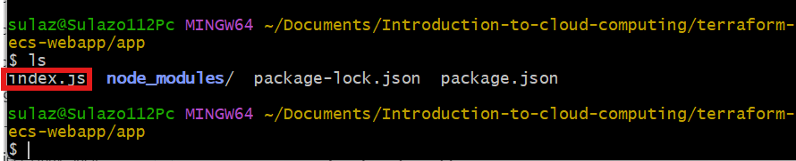
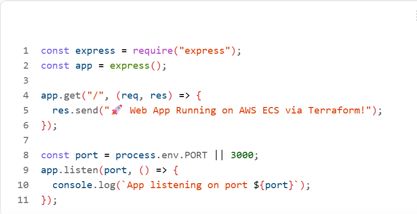
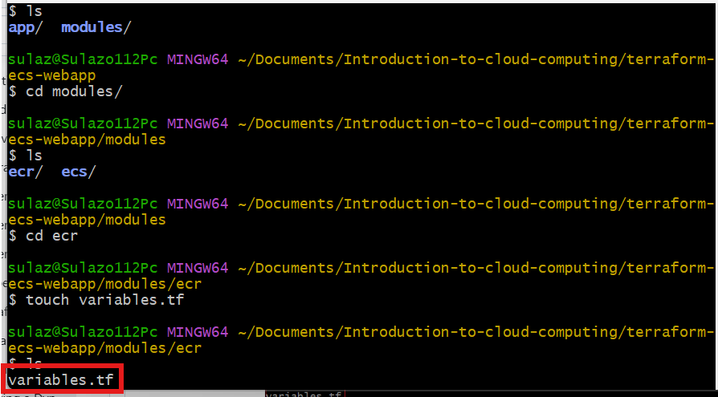
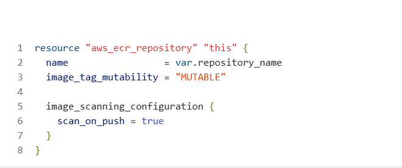
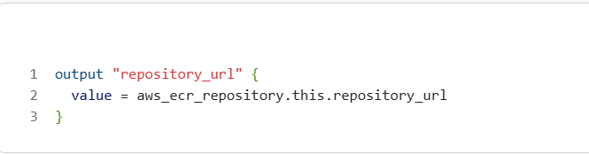
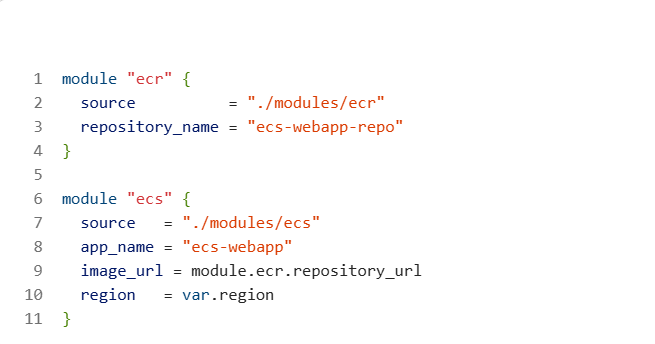

# Mini Project: Hosting a Dynamic Web App on AWS with Terraform Module, Docker, Amazon ECR, and ECS

#### Purpose:

In this mini project, you will use Terraform to create a modular infrastructure for hosting a dynamic web application on Amazon ECS (Elastic Container Service). The project involves containerizing the web app using Docker, pushing the Docker image to Amazon ECR (Elastic Container Registry), and deploying the app on ECS.

### Objectives:

1. Terraform Module Creation:

Learn how to create Terraform modules for modular infrastructure provisioning.

2. Dockerization:

Containerize a dynamic web application using Docker.

3. Amazon ECR Configuration:

Configure Terraform to create an Amazon ECR repository for storing Docker images.

4. Amazon ECS Deployment:

Use Terraform to provision an ECS cluster and deploy the Dockerized web app.

### Project Tasks:

#### Task 1: Dockerization of Web App

1. Create a dynamic web application using a technology of your choice (e.g., Node.js, Flask, Django).

2. Write a Dockerfile to containerize the web application.

3. Test the Docker image locally to ensure the web app runs successfully within a container.

#### Task 2: Terraform Module for Amazon ECR

1. Create a new directory for your Terraform project (e.g., terraform-ecs-webapp).

2. Inside the project directory, create a directory for the Amazon ECR module (e.g., modules/ecr).

3. Write a Terraform module (modules/ecr/main.tf) to create an Amazon ECR repository for storing Docker images.

#### Task 3: Terraform Module for ECS

1. Inside the project directory, create a directory for the ECS module (e.g., modules/ecs).

2. Write a Terraform module (modules/ecs/main.tf) to provision an ECS cluster and deploy the Dockerized web app.

#### Task 4: Main Terraform Configuration

1. Create the main Terraform configuration file (main.tf) in the project directory.

2. Use the ECR and ECS modules to create the necessary infrastructure for hosting the web app.

#### Task 5: Deployment

1. Build the Docker image of your web app.

2. Push the Docker image to the Amazon ECR repository created by Terraform.

3. Run terraform init and terraform apply to deploy the ECS cluster and the web app.

4. Access the web app through the public IP or DNS of the ECS service.

### Instructions:

### Prerequisites (Do This First)

#### Install and configure the following:

1. AWS Account

2. AWS CLI aws --version

3. Configure AWS credentials 

Fill in:

Access Key, Secret Key, Region (e.g. us-east-1).

4. Docker docker --version

5. Terraform terraform --version

### Project Structure

Create the directory structure exactly like this:

1. Create a new directory for your Terraform project using a terminal (mkdir terraform-ecs-webapp).

2. Change into the project directory (cd terraform-ecs-webapp).

3. Create directories for the ECR and ECS modules (mkdir -p modules/ecr and mkdir -p modules/ecs).

mkdir -p app

mkdir -p modules/ecr

mkdir -p modules/ecs

### Final structure:

3.Write the ECR module configuration (nano modules/ecr/main.tf) to create an ECR repository.

4. Write the ECS module configuration (nano modules/ecs/main.tf) to provision an ECS cluster and deploy the Dockerized web app.

5. Create the main Terraform configuration file (nano main.tf) and use the ECR and ECS modules.

6. Build the Docker image of your web app and push it to the ECR repository.

7. Run terraform init and terraform apply to deploy the ECS cluster and the web app.

8. Access the web app through the public IP or DNS of the ECS service.

9. Document your observations and any challenges faced during the project.

#### TASK 1: Create & Dockerize a Dynamic Web App

#### Step 1.1 Create a Simple Node.js Web App Inside app/

cd app

npm init -y

npm install express

#### Create index.js file:

index.js

Copy the bolow code inside the file

#### Update package.json file:

Package.json file updated

### Step 1.2 – Write the Dockerfile

#### Create Dockerfile inside app/:

Paste the code below:

touch dockerfile

#### Step 1.3 – Test Locally with Docker

docker build -t my-webapp .

docker run -p 3000:3000 my-webapp

✅ Let Visit:
http://localhost:3000

If it works → lets proceed.

### TASK 2: Terraform Module for Amazon ECR

#### Step 2.1 – modules/ecr/variables.tf

touch variables.tf

#### Step 2.2 – modules/ecr/main.tf

touch main.tf

#### Step 2.3 – modules/ecr/outputs.tf

touch output.tf

### TASK 3: Terraform Module for ECS (Fargate)

#### Step 3.1 – modules/ecs/variables.tf

touch variables.tf

### Step 3.2 – modules/ecs/main.tf

touch main.tf

### TASK 4: Main Terraform Configuration

#### Step 4.1 – providers.tf

provider.tf

### Step 4.2 – variables.tf

variables.tf

#### Step 4.3 – main.tf

main.tf

### TASK 5: Build & Push Docker Image to ECR

#### Step 5.1 – Login to ECR

Run this command to get you ID:

aws sts get-caller-identity --query Account --output text

Replace the Account_ID with your ID

### Step 5.2 – Build & Tag Image

using the below, replace ECR repo URL with your ecr repo URL:

docker build -t ecs-webapp .

docker tag ecs-webapp:latest <ECR_REPO_URL>:latest

#### Step 5.3 – Push Image

docker push <ECR_REPO_URL>:latest

replace the ECR repo url with your url

docker push \
  522632170257.dkr.ecr.us-east-1.amazonaws.com/my-webapp-repo:latest

Error Encounter:

❌ The ECR repository does NOT exist

The repository with name 'ecs-webapp-repo' does not exist in the registry with id '121846058619'

This confirms:

👉 Terraform did NOT create an ECR repository named: ecs-webapp-repo

👉 But you are trying to push your image to: 121846058619.dkr.ecr.us-east-1.amazonaws.com/ecs-webapp-repo

#### FIX IN 3 SIMPLE STEPS (DO EXACTLY THIS)

STEP 1 — Verify What Repository Terraform Actually Created

aws ecr describe-repositories --region us-east-1

This confirm no repository created in AWS

STEP 2 — Create the repository if it does not exist

Since the repo is missing, lets manually create it:

aws ecr create-repository \ --repository-name ecs-webapp-repo \ --region us-east-1

STEP 3 — Push your image again

docker tag my-webapp:latest 121846058619.dkr.ecr.us-east-1.amazonaws.com/ecs-webapp-repo:latest

Re‑tag:

Push: 

docker push \
  522632170257.dkr.ecr.us-east-1.amazonaws.com/ecs-webapp-repo:latest

 Image is now in Amazon ECR.

 #### TASK 6: Terraform Deployment

 terraform init

 

terraform validate

terraform plan

terraform apply

#### TASK 7: Access the Web App

Application Page

#### Common Challenges & Solutions

Challenge: ECR push fails

Solution: Check AWS login & permissions

Challenge: Task keeps stopping

Solution: Check CloudWatch logs

What I have Learned

✅ Dockerizing applications

✅ Terraform modules

✅ Amazon ECR image storage

✅ ECS + Fargate deployment

✅ Real production workflow

Run Terraform Destroy to clean the deployment:

terraform destroy

#### Side Note:

Ensure you have the AWS CLI installed and configured with appropriate credentials.

Modify variables and configurations in the modules based on your specific requirements.

Replace placeholder values in the main configuration file with actual values.

This is a learning exercise; use it to gain hands-on experience with Terraform, Docker, Amazon ECR, and ECS.

END.

