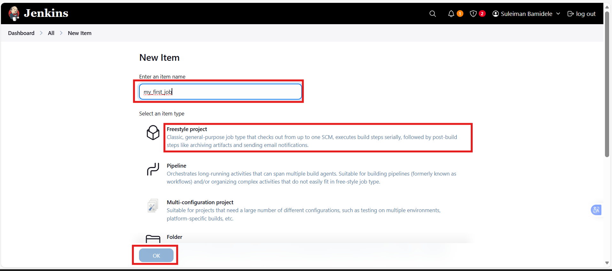
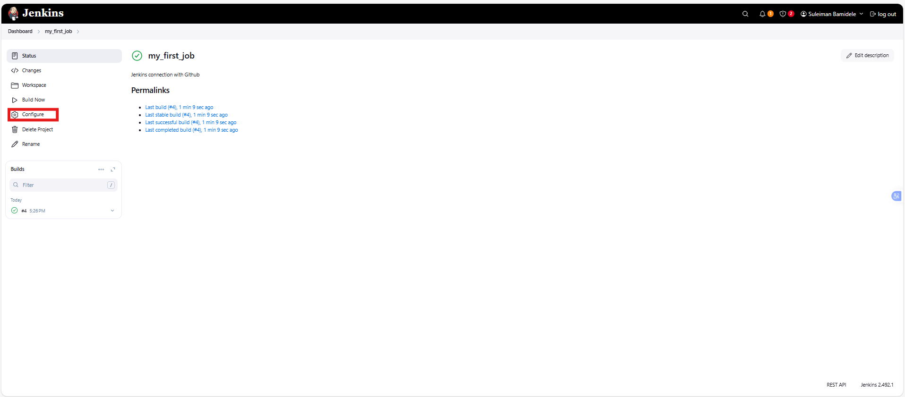
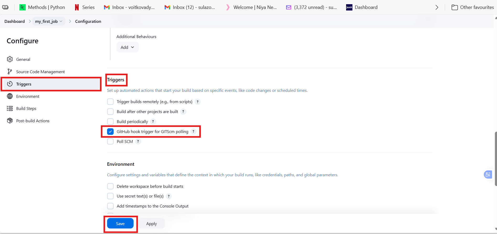
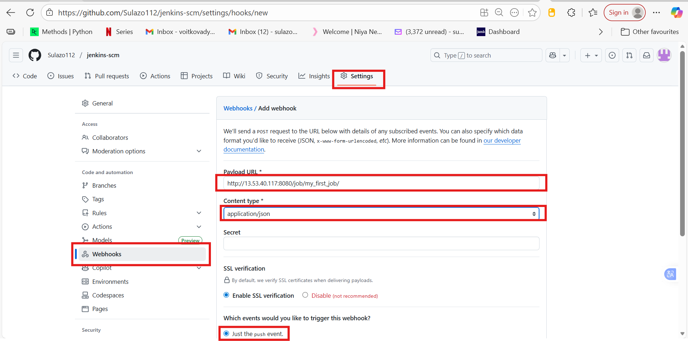

# Jenkins Freestyle Project

### Jenkins Job

In Jenkins, a job is a unit of work or a task that can be executed by the Jenkins automation server.

A Jenkins job represents a specific task or set of tasks that needs to be performed as part of a build or deployment process. Jobs in Jenkins are created to automate the execution of various steps such as compiling code, running tests, packaging applications, and deploying them to servers. Each Jenkins job is configured with a series of build steps, post-build actions, and other settings that define how the job should be executed.

### Creating a Freestyle Project

Let's create our first build job

i. From the dashboard menu on the left side, click on new item

ii. Create a freestyle project and name it "my-first-job"

### Connecting Jenkins To Our Source Code Management

Now that we have created a freestyle project, let connect jenkins with github.

i. Create a new github repository called jenkins-scm with a README.md file

ii. Connect jenkins to jenkins-scm repository by pasting the repository url in the area selected below. Make sure your current branch is main.

iii. Save configuration and run "build now" to connect jenkins to our repository.

We have successfully connected jenkins with our github repository (jenkins-scm)

### Configuring Build Trigger

As an engineer, we need to be able to automate things and make our work easier in possible ways. We have connected jenkins to jenkins-scm, but we cannot run a new build with clicking on Build Now. To eliminate this, we need to confiure a build trigger to our jenkins job. With this, jenkins will run a new build anytime a change is made to our github repository.

i. Click "Configure" your job and add this configurations.

ii. Click on build trigger to configure triggering the job from GitHub webhook.

iii. Create a github webhook using jenkins ip address and port

Now, Lets go ahead and make some change in any file in our GitHub repository (e.g. README.MD file) and push the changes to the master branch.

You will see that a new build has been launched automatically (by webhook)

END.
