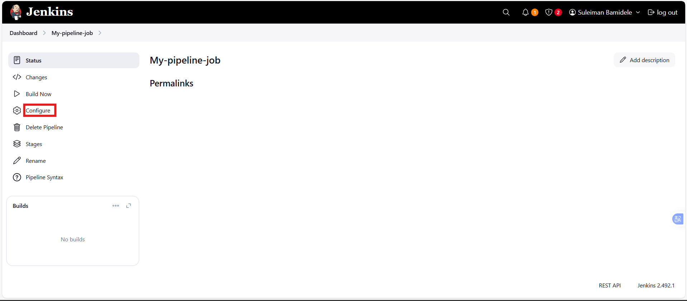
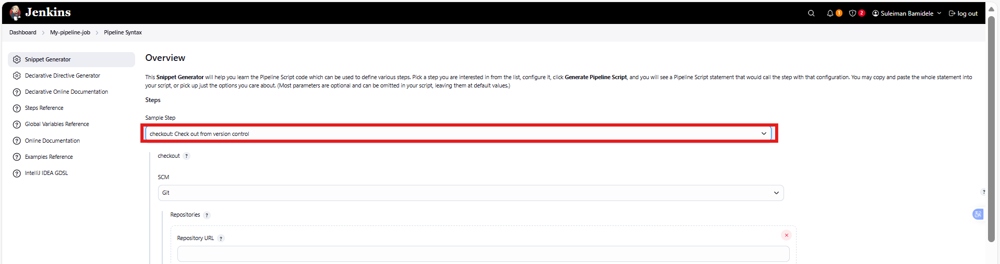
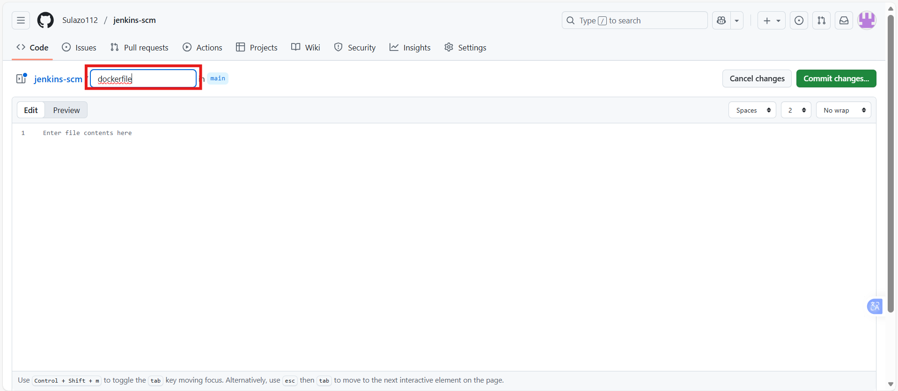
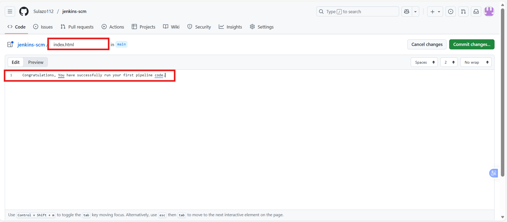

# Jenkins Pipeline Job

### What is a Jenkins Pipeline Job

A Jenkins pipeline job is a way to define and automate a series of steps in the software delivery process. It allows you to script and organize your entire build, test, and deployment. Jenkins pipelines enable organizations to define, visualize, and execute intricate build, test, and deployment processes as code. This facilitates the seamless integration of continuous integration and continuous delivery (CI/CD) practices into software development.

Let's recall our docker foundations project when we created a dockerfile and made a docker image and container with it. Now let's automate the same process with jenkins pipeline code.

### Creating a Pipeline Job

Let's create our first pipeline job

i. From the dashboard menu on the left side, click on new item

ii. Create a pipeline job and name it "My pipeline job"

### Configuring Build Trigger

Like we did prevoiusly in the earler project, create a build trigger for jenkins to trigger new build

i. Click "Configure" your job and add this configurations

ii. Click on build trigger to configure triggering the job from GitHub webhook

iii. Since we have created a github webhook previously, we do not need to create another one again. let create another one.

Use this link: https://www.youtube.com/watch?v=ZiHMsEKklKQ

Now let's work on our pipeline script

### Writing Jenkins Pipeline Script

A jenkins pipeline script refers to a script that defines and orchestrates the steps and stages of a continuous integration and continuous delivery (CI/CD) pipeline.

Jenkins pipelines can be defined using either declarative or scripted syntax. Declarative syntax is a more structured and concise way to define pipelines. It uses a domain-specific language to describe the pipeline stages, steps, and other configurations while scripted syntax provides more flexibility and is suitable for complex scripting requirements.

Let's write our pipeline script

### Explanation of the script above

The provided Jenkins pipeline script defines a series of stages for a continuous integration and continuous delivery (CI/CD) process. Let's break down each stage:

1. ### Agent Configuration:

agent any

Specifies that the pipeline can run on any available agent (an agent can either be a jenkins master or node). This means the pipeline is not tied to a specific node type.

2. #### Stages:

stages {"\n      // Stages go here\n   "}

Defines the various stages of the pipeline, each representing a phase in the software delivery process.

3. #### Stage 1: Connect To Github:

stage('Connect To Github') {"\n      steps {\n         checkout scmGit(branches: [[name: '*/main']], extensions: [], userRemoteConfigs: [[url: 'https://github.com/Sulazo112/jenkins-scm.git']])\n      "} }

This stage checks out the source code from a GitHub repository (https://github.com/Sulazo112/jenkins-scm.git).

It specifies that the pipeline should use the 'main' branch.

4. #### Stage 2: Build Docker Image:

stage('Build Docker Image') {"\n      steps {\n         script {\n            sh 'docker build -t dockerfile .'\n         "} } }

This stage builds a Docker image named 'dockerfile' using the source code obtained from the GitHub repository.
The docker build command is executed using the shell (sh).

5. #### Stage 3: Run Docker Container:

stage('Run Docker Container') {"\n      steps {\n         script {\n            sh 'docker run -itd --name nginx -p 8081:80 dockerfile'\n         "} } }

This stage runs a Docker container named 'nginx' in detached mode (-itd).

The container is mapped to port 8081 on the host machine (-p 8081:80).

The Docker image used is the one built in the previous stage ('dockerfile').

Copy the pipeline script and paste it in the section below:

The stage 1 of the script connects jenkins to github repository. To generate syntax for our github repository, follow the steps below

i. Click on the pipeline syntax

ii. Select the drop down to search for checkout: Check out from version control

iii. Paste you repository url and make sure your branch is main.

iv Generate your pipeline script.

Now you can replace the generated script for connect jenkins with github.

### Installing Docker

Before jenkins can run docker commands, we need to install docker on the same instance jenkins was installed. From our shell scripting knownledge, let's install docker with shell script.

i. Create a file named docker.sh

touch docker.sh

ii. Open the file and paste the script below

iii. Save and close the file

iv Make the file executable

chmod u+x docker.sh

v. Execute the file

./docker.sh

We have successfully installed docker.

### Building Pipeline Script

Now that we have docker installed on the same instance with jenkins, we need to create a dockerfile before we can run our pipeline script. As we know, we cannot build a docker image without a dockerfile. Let's recall the dockerfile we used to build a docker image in our docker foundations. In the main branch on jenkins-scm,

i. Create a new file named dockerfile

ii. Paste the code snippet below in the file

iii. Create an index.html file and paste the content below

Congratulations, You have successfully run your first pipeline code.

Pushing these files dockerfile and index.html will trigger jenkins to automatically run new build for our pipeline.

We can now access the content of index.html on our web browser

http://jenkins-ip-address:8081

http://13.53.40.117:8081

END.

