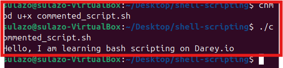

# Linux Shell Scripting (Comments)

## Adding Comments in Bash Scripts

Comments are essential in programming, serving as notes to the programmer and anyone else who might read the code.

They explain what the script or parts of the script do, making the code easier to understand and maintain. This section will guide us on how to add comments in Bash scripts.

### What Are Comments?

Comments are lines in our code that are ignored by the interpreter. In Bash scripts, comments help document the purpose and logic of our code, making it easier for others (and ourself) to follow and understand the script's functionality.

### Single-Line Comments

Single-line comments in Bash start with the # symbol. Anything following this symbol on the same line is treated as a comment and is not executed.

### Using Multiple Single-Line Comments

This approach is straightforward and is commonly used for adding brief descriptions or notes spanning multiple lines.

### Best Practices for Commenting:

Clarity: Write clear and concise comments that explain the "why" behind the code, not just the "what".
Maintainability: Keep comments updated as you modify the code to ensure they remain relevant and helpful.
Usefulness: Comment on complex or non-obvious parts of the script to provide insights into your thought process and decision-making.
Avoid Overcommenting: Don't comment on every line of code, especially if the code is self-explanatory. Focus on parts that benefit from additional explanation.
At this stage, we'ev established a solid foundation in Bash/shell scripting. (It's worth noting that Bash and Shell are similar in functionality, which is why their names are often used interchangeably, despite being distinct interpreters.)

End.