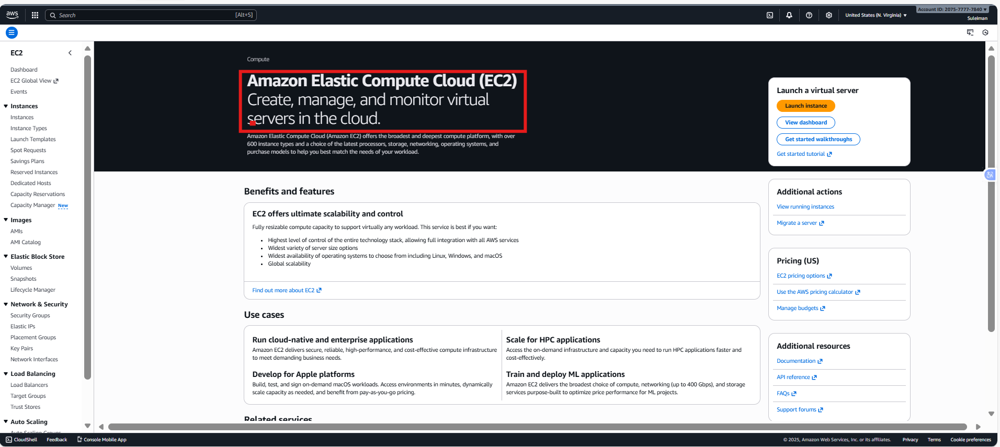
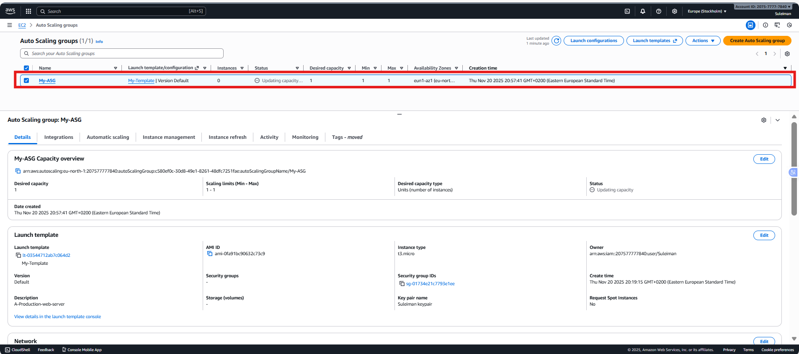
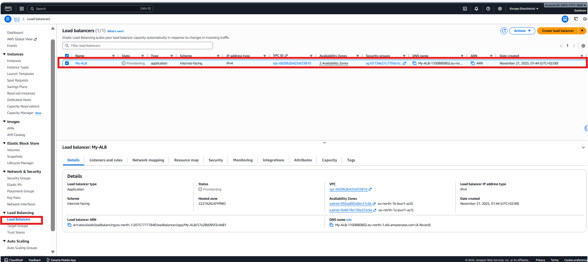
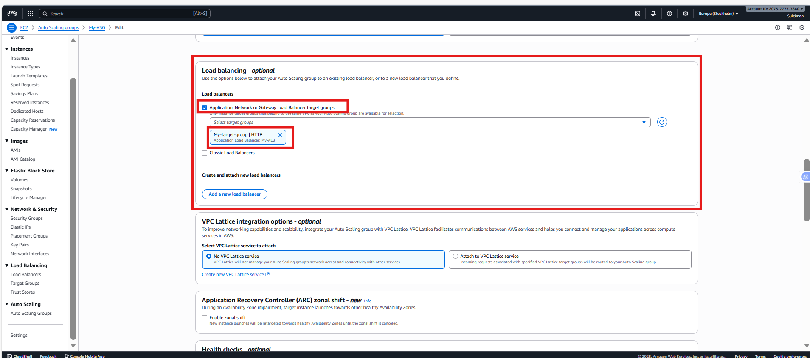
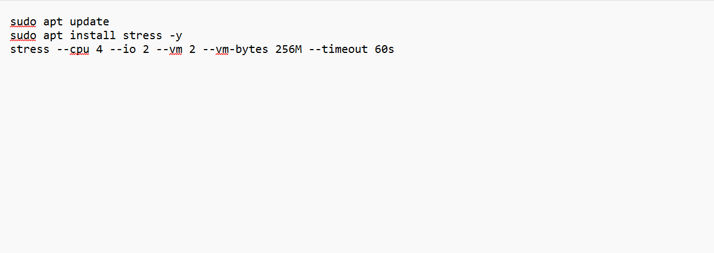
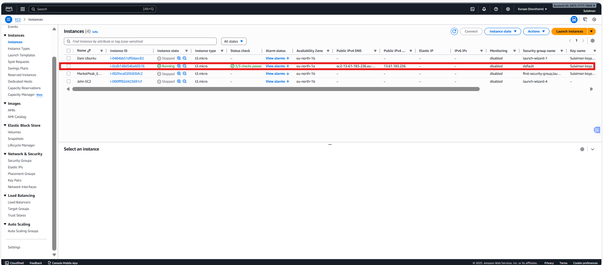
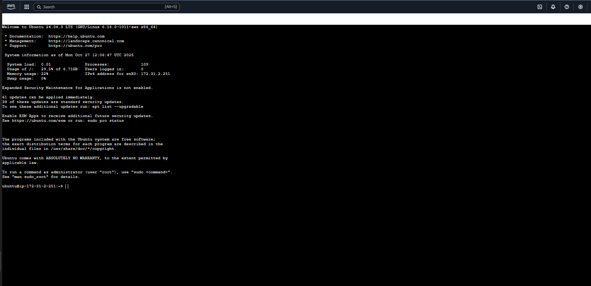

# Mini Project: Configuring Auto Scaling with ALB using Launch Template

### Purpose:

In this mini project, we will learn how to configure Auto Scaling in AWS with an Application Load Balancer (ALB) using a Launch Template. The project aims to demonstrate the automatic scaling of EC2 instances based on demand, while leveraging the benefits of a Launch Template.

### Objectives:

1. Create Launch Template:

Learn how to create a Launch Template with the required specifications.

2. Set Up Auto Scaling Group:

Configure an Auto Scaling group to manage the desired number of EC2 instances using the Launch Template.
Configure Scaling Policies:

Set up scaling policies to adjust the number of instances based on demand.
Attach ALB to Auto Scaling Group:

Connect the Auto Scaling group to an existing ALB.
Test Auto Scaling:

Verify that the Auto Scaling group adjusts the number of instances in response to changes in demand.

## Project Tasks:

### Task 1: Create Launch Template**

1. Log in to the AWS Management Console.

2. Navigate to the EC2 service.

3. In the left navigation pane, click on "Launch Templates."

4. Click the "Create launch template" button.

5. Configure the launch template settings, including the AMI, instance type, and user data

### Task 2: Set Up Auto Scaling Group

1. In the AWS Management Console, navigate to the EC2 service.

2. In the left navigation pane, click on "Auto Scaling Groups.

3. Click the "Create Auto Scaling group" button.

4. Choose "Use Launch Template" and select the Launch Template you created.

5. Configure the Auto Scaling group settings, including the group name, desired capacity, and initial instances.

6. Set up additional configurations such as network settings, subnets, and scaling policies.

### Task 3: Configure Scaling Policies

1. In the Auto Scaling group configuration, navigate to the "Scaling policies" section.

2. Click on "Create scaling policy" and configure policies for scaling in and scaling out based on demand.

### Task 4: Attach ALB to Auto Scaling Group

1. In the Auto Scaling group configuration, navigate to the "Load balancing" section.

2. Click on "Edit" and select the ALB to associate with the Auto Scaling group.

### Task 5: Test Auto Scaling

1. Generate traffic to trigger scaling policies.

Connect to Instance using EC2 Instance Connect

2. Monitor the Auto Scaling group and verify that the number of instances adjusts based on demand.

END.