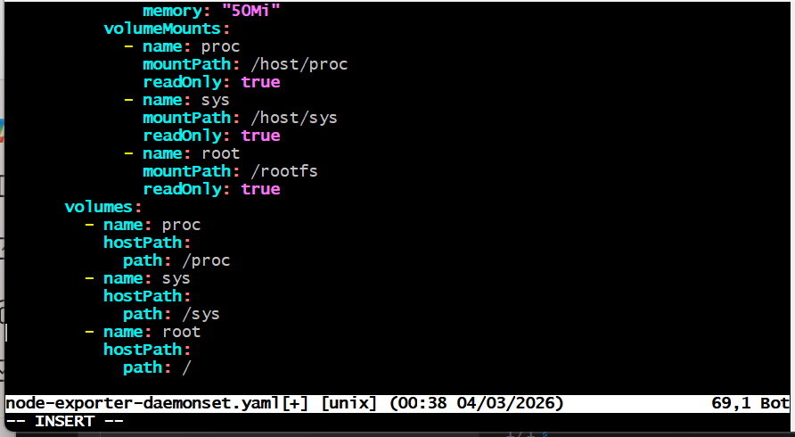

# Setup Prometheus Node Exporter on Kubernetes

### Introduction

Prometheus is a widely-used monitoring system that collects and processes metrics from various sources. The Node Exporter is a Prometheus exporter that collects hardware and operating system metrics from a system. By deploying Node Exporter on Kubernetes, you can monitor the nodes in your Kubernetes cluster and gain insights into their performance.

### Objectives

1. Understand the purpose of Prometheus Node Exporter.

2. Deploy Node Exporter as a DaemonSet in a Kubernetes cluster.

3. Configure Prometheus to scrape metrics from Node Exporter.

4. Visualize metrics using Prometheus UI.

5. Explore metrics available through Node Exporter.

### Prerequisites

1. Kubernetes Cluster: A working Kubernetes cluster (e.g., Minikube, Kind, or a managed kubernetes service like EKS or AKS or GKE).

2. Kubernetes CLI: kubectl installed and configured for your cluster.

3. Prometheus Setup: Basic Prometheus installation running in the Kubernetes cluster.

4. Tools: A text editor to modify YAML files.

### Tasks Outline

1. Understand how Node Exporter works and its purpose.

2. Deploy Node Exporter as a DaemonSet.

3. Configure Prometheus to scrape metrics from Node Exporter.

4. Verify the metrics in Prometheus.

5. Explore the metrics provided by Node Exporter.

### Project Tasks

#### Task 1 - Understand How Node Exporter Works

1. Node Exporter is a lightweight application that runs on a node and exposes metrics about the node’s hardware and operating system.

2. Key metrics include:

CPU and memory usage
Disk I/O
Network statistics
Filesystem usage

3. Node Exporter runs as a containerized application in Kubernetes to collect metrics from each node.

### PART 1 — Install Kubernetes (Minikube) on Ubuntu

Minikube is the easiest option for a lightweight Kubernetes cluster inside a VM.

#### STEP 1 — Install Required Dependencies

Run inside Ubuntu terminal:

sudo apt update

sudo apt install -y curl wget apt-transport-https ca-certificates conntrack

#### STEP 2 — Install Docker (Container Runtime)

sudo apt install -y docker.io

sudo systemctl enable docker

sudo systemctl start docker

sudo usermod -aG docker $USER

Log out and back in so Docker permissions take effect.

#### STEP 3 — Install Minikube

curl -LO https://storage.googleapis.com/minikube/releases/latest/minikube-linux-amd64

sudo install minikube-linux-amd64 /usr/local/bin/minikube

#### STEP 4 — Install kubectl

curl -LO "https://dl.k8s.io/release/$(curl -L -s https://dl.k8s.io/release/stable.txt)/bin/linux/amd64/kubectl"

sudo install kubectl /usr/local/bin/

#### STEP 5 — Start Minikube on Desktop

minikube start --driver=docker --cpus=4 --memory=4096

Verify:

kubectl get nodes

You should see: minikube Ready

### PART 2 — Install Prometheus on Kubernetes

We’ll install basic Prometheus using a Deployment + Service (not Helm), since our task assumes a simple configuration.

#### STEP 1 — Create monitoring namespace

kubectl create namespace monitoring

#### STEP 2 — Deploy Prometheus YAML

Create file:

Create a YAML file for the Node Exporter DaemonSet:
vim prometheus-deploy.yaml

Paste:

2. #### Apply the YAML file using kubectl:

kubectl apply -f prometheus-deploy.yaml

3. Verify the deployment:
kubectl get pods -n monitoring

### PART 3 — Deploy Node Exporter as DaemonSet

Create:

vi node-exporter-daemonset.yaml

Paste your YAML:

Apply:

kubectl apply -f node-exporter-daemonset.yaml

Verify:

kubectl get daemonset -n monitoring

#### Create Node Exporter Service

vi node-exporter-service.yaml

Apply it:

kubectl apply -f node-exporter-service.yaml

Prometheus will now detect node-exporter automatically (because of the scrape job added earlier).

### PART 4 — Access Prometheus UI

Access the Prometheus UI (e.g., by port-forwarding):

kubectl port-forward svc/prometheus 9090:9090 -n monitoring

Go to:

http://localhost:9090

### PART 5 — Explore Metrics Provided by Node Exporter

In the Prometheus UI query bar, test:

CPU Metrics

node_cpu_seconds_total

Memory

node_memory_MemAvailable_bytes

Disk

node_filesystem_avail_bytes

Network

rate(node_network_receive_bytes_total[5m])

#### Conclusion

By completing this project, we’ve set up Prometheus Node Exporter on Kubernetes, enabling comprehensive monitoring of node-level metrics. we’ve also integrated Node Exporter with Prometheus, learned to query metrics, and explored the data it provides. This setup can now be extended with dashboards (e.g., Grafana) or alerts for advanced monitoring needs.

