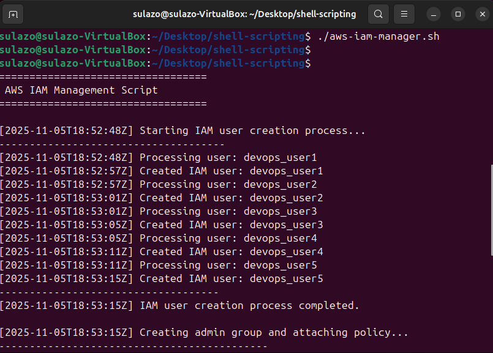

# Shell Script for AWS IAM Management

## Project Scenario

CloudOps Solutions is a growing company that recently adopted AWS to manage its cloud infrastructure. As the company scales, they have decided to automate the process of managing AWS Identity and Access Management (IAM) resources. This includes the creation of users, user groups, and the assignment of permissions for new hires, especially for their DevOps team.

### Purpose

To extend our shell scripting capabilities by creating more functions inside the "aws-iam-manager.sh" script to fulfill the objectives below. Ensure that you have already configured AWS CLI in your terminal and the configured AWS Account have the appropriate permissions to manage IAM resources.

### Objectives:

Extend the provided script to include IAM management by:

Defining IAM User Names Array to store the names of the five IAM users in an array for easy iteration during user creation.
Create the IAM Users as you iterate through the array using AWS CLI commands.
Define and call a function to create an IAM group named "admin" using the AWS CLI commands.
Attach an AWS-managed administrative policy (e.g., "AdministratorAccess") to the "admin" group to grant administrative privileges.
Iterate through the array of IAM user names and assign each user to the "admin" group using AWS CLI commands.

### Provided Script

#!/bin/bash

AWS IAM Manager Script for CloudOps Solutions
This script automates the creation of IAM users, groups, and permissions
Define IAM User Names Array
IAM_USER_NAMES=()

Function to create IAM users
create_iam_users() {"\n echo "Starting IAM user creation process..."\n echo "-------------------------------------"\n \n echo "---Write the loop to create the IAM users here---"\n \n echo "------------------------------------"\n echo "IAM user creation process completed."\n echo ""\n"}

Function to create admin group and attach policy
create_admin_group() {"\n echo "Creating admin group and attaching policy..."\n echo "--------------------------------------------"\n \n # Check if group already exists\n aws iam get-group --group-name "admin" >/dev/null 2>&1\n echo "---Write this part to create the admin group---"\n \n # Attach AdministratorAccess policy\n echo "Attaching AdministratorAccess policy..."\n echo "---Write the AWS CLI command to attach the policy here---"\n \n if [ $? -eq 0 ]; then\n echo "Success: AdministratorAccess policy attached"\n else\n echo "Error: Failed to attach AdministratorAccess policy"\n fi\n \n echo "----------------------------------"\n echo ""\n"}

Function to add users to admin group
add_users_to_admin_group() {"\n echo "Adding users to admin group..."\n echo "------------------------------"\n \n echo "---Write the loop to handle users addition to the admin group here---"\n \n echo "----------------------------------------"\n echo "User group assignment process completed."\n echo ""\n"}

Main execution function
main() {"\n echo "=================================="\n echo " AWS IAM Management Script"\n echo "=================================="\n echo ""\n \n # Verify AWS CLI is installed and configured\n if ! command -v aws &> /dev/null; then\n echo "Error: AWS CLI is not installed. Please install and configure it first."\n exit 1\n fi\n \n # Execute the functions\n create_iam_users\n create_admin_group\n add_users_to_admin_group\n \n echo "=================================="\n echo " AWS IAM Management Completed"\n echo "=================================="\n"}

Execute main function
main
exit 0

### Pre-requisite

1. Ensure that you have already configured AWS CLI in your terminal and the configured AWS Account have the appropriate permissions to manage IAM resources.
2. Completion of Linux foundations with Shell Scripting mini projects.

### Project Deliverables

Submit the following deliverables:

1. Comprehensive documentation detailing your entire thought process in developing the script.
2. Link to the extended script.

### Solution

### AWS IAM Manager Script & Documentation

Create a Filename: aws-iam-manager.sh

Purpose: This document contains a production-ready Bash script that automates the creation of IAM users, an admin group, attaches the AWS-managed AdministratorAccess policy to that group, and assigns a list of users to the group. It also explains the design decisions, safety considerations, and how to run/test the script.

### Quick summary

The script is idempotent: running it multiple times will not fail when users or the group already exist.

It uses AWS CLI only (no external tools like jq).

It validates that the AWS CLI is installed and that credentials are functional before making changes.

### Prerequisites

AWS CLI installed and configured (aws configure) with credentials that have IAM management permissions.

AWS CLI, was installed using this link: 

https://www.geeksforgeeks.org/devops/how-to-install-aws-cli-on-ubuntu/

User Suleiman was created on my aws account and provided programmatic access to be able to access aws resources.

For security Purpose the key was shaded:

Network access to AWS endpoints.

Run the script from a secure machine. Avoid creating credentials on shared/public machines.

### My Design notes and thought process

#### Idempotency

Each creation step first checks whether the resource exists using aws iam get-user / aws iam get-group. This prevents failures on re-runs and supports safe automation.

### Permissions

The script attaches the AWS-managed policy arn:aws:iam::aws:policy/AdministratorAccess to the group. This is convenient for lab/demo setups but for production consider least-privilege custom policies.

### Error handling

The script checks exit codes around the critical AWS CLI calls and prints clear messages on success/failure.

### Security considerations

The script does not create or print long-lived access keys or console passwords for users (doing so would require careful handling). If you need programmatic access, create access keys in a secure manner and rotate them.

Prefer IAM Roles (with instance profiles) instead of user accounts where possible.

### Limitations & warnings

AdministratorAccess grants full administrative privileges; use only where appropriate.

### The Script

Script also attached.

### How to use

(Optional) Edit the IAM_USER_NAMES array in the script to your preferred user names.

Make the script executable:chmod +x aws-iam-manager.sh

Run it: ./aws-iam-manager.sh

Confirm created resources with aws iam list-users and aws iam get-group --group-name admin.

### My Post-deployment checks

aws iam list-users — verify users exist.

AWS iam get-group --group-name admin — verify group and members.

AWS iam list-attached-group-policies --group-name admin — confirm AdministratorAccess is attached.

END.

