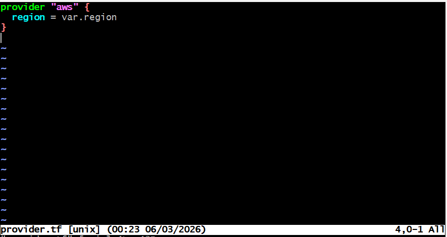
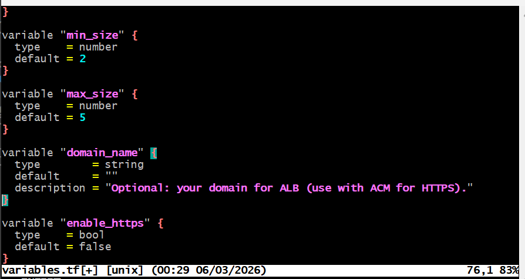
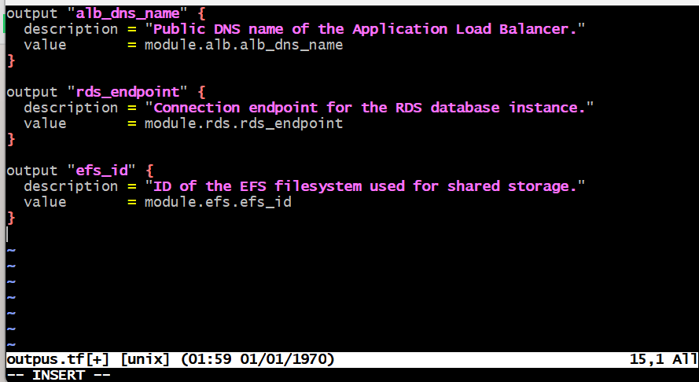

# Terraform Capstone Project Automated WordPress Deployment on AWS

## Automated WordPress deployment on AWS

### Project Scenario

DigitalBoost, a digital marketing agency, aims to elevate its online presence by launching a high-performance WordPress website for their clients. As an AWS Solutions Architect, your task is to design and implement a scalable, secure, and cost-effective WordPress solution using various AWS services. Automation through Terraform will be key to achieving a streamlined and reproducible deployment process.

### Pre-requisite

. Knowledge of TechOps Essentials
. Completion of Core 2 Courses and Mini Projects

The project overview, necessary architecture, and scripts have been provided to help DigitalBoost with their WordPress-based website. Follow the instructions below to complete this Terraform Capstone Project.

### Project Deliverables

#### Documentation:

. Detailed documentation for each component setup.
. Explanation of security measures implemented.

#### Demonstration:

. Live demonstration of the WordPress site.
. Showcase auto-scaling by simulating increased traffic.

#### Project Overview

### Project Components

1. #### VPC Setup

VPC ARCHITECTURE

. Objective: Create a Virtual Private Cloud (VPC) to isolate and secure the WordPress infrastructure.

Steps:

. Define IP address range for the VPC.
. Create VPC with public and private subnets.
. Configure route tables for each subnet.

#### Instructions for Terraform:

. Use Terraform to define VPC, subnets, and route tables.
. Leverage variables for customization.
. Document Terraform commands for execution.

2. #### Public and Private Subnet with NAT Gateway

NAT GATEWAY ARCHITECTURE

. Objective: Implement a secure network architecture with public and private subnets. Use a NAT Gateway for private subnet internet access.

Steps:

. Set up a public subnet for resources accessible from the internet.
. Create a private subnet for resources with no direct internet access.
. Configure a NAT Gateway for private subnet internet access.

#### Instructions for Terraform:

. Utilize Terraform to define subnets, security groups, and NAT Gateway.
. Ensure proper association of resources with corresponding subnets.
. Document Terraform commands for execution.

3. #### AWS MySQL RDS Setup

SECURITY GROUP ARCHITECTURE

. Objective: Deploy a managed MySQL database using Amazon RDS for WordPress data storage.

Steps:

. Create an Amazon RDS instance with the MySQL engine.
. Configure security groups for the RDS instance.
. Connect WordPress to the RDS database.

#### Instructions for Terraform:

. Define Terraform scripts for RDS instance creation.
. Configure security groups and define necessary.parameters.
. Document Terraform commands for execution.

4. #### EFS Setup for WordPress Files

. Objective: Utilize Amazon Elastic File System (EFS) to store WordPress files for scalable and shared access.

Steps

. Create an EFS file system.
. Mount the EFS file system on WordPress instances.
. Configure WordPress to use the shared file system.

#### Instructions for Terraform:

. Develop Terraform scripts to create EFS file system.
. Define configurations for mounting EFS on WordPress .instances.
. Document Terraform commands for execution.

5. #### Application Load Balancer

. Objective: Set up an Application Load Balancer to distribute incoming traffic among multiple instances, ensuring high availability and fault tolerance.

Steps:

. Create an Application Load Balancer.
. Configure listener rules for routing traffic to instances.
. Integrate Load Balancer with Auto Scaling group.

6. #### Auto Scaling Group

. Objective: Implement Auto Scaling to automatically adjust the number of instances based on traffic load.

Steps:

. Create an Auto Scaling group.
. Define scaling policies based on metrics like CPU utilization.
. Configure launch configurations for instances.

#### Instructions for Terraform:

. Develop Terraform scripts for Auto Scaling group creation.
. Define scaling policies and launch configurations.
. Document Terraform commands for execution.

Note: Provide thorough documentation for each Terraform script and include necessary variable configurations. Encourage students to perform a live demonstration of the WordPress site, showcasing auto-scaling capabilities by simulating increased traffic. The documentation should explain the security measures implemented at each step.

#### Solution

Below is a complete, step-by-step Terraform solution to deploy a scalable, secure, cost-aware WordPress stack on AWS using VPC + Public/Private Subnets + NAT + ALB + Auto Scaling + RDS (MySQL) + EFS. I will included:

. A clean Terraform folder structure
. Re-usable modules for each component
. Fully working Terraform code snippets
. Security best practices at every step
. Demo steps for a live test + auto-scaling simulation
. Cost control tips and operational guidance

✅ Assumptions (safe defaults):

. AWS Region: configurable via var.region (default: us-east-1)
. Terraform >= 1.5, AWS provider >= 5.X
. You have an AWS account with IAM permissions
. You’ll use AWS Systems Manager (SSM) instead of SSH for instance access (no open SSH ports)
. WordPress connects to RDS using the private network; app servers do not have public IPs
. EFS stores wp-content uploads to be shared across autoscaled instances

1. #### Repository & Module Layout

2. #### Security Model (applies across the stack)

Network isolation:

. Public subnets: ALB, NAT Gateway only.
. Private subnets: EC2 (WordPress) & RDS & EFS Mount Targets.
. No public IPs on EC2/RDS. Outbound internet via NAT only.

#### Least privilege security groups:

. ALB: inbound :80 (and optionally :443) from the internet.
. ASG/EC2: inbound :80 only from ALB SG; SSM access via VPC endpoints (or AWS-managed).
. RDS: inbound :3306 only from EC2 SG.
. EFS: inbound :2049 only from EC2 SG.

#### Secrets & credentials:

. DB password stored in AWS SSM Parameter Store (SecureString) or AWS Secrets Manager.
. Never hardcode creds in Terraform state; use references.

#### TLS (recommended for prod):

Add ACM certificate + ALB HTTPS listener (443) + redirect from 80 → 443.

IAM & access:

Attach AmazonSSMManagedInstanceCore to EC2 instances.

No inbound SSH from internet.

High availability:

Subnets spread across 2+ AZs.

ALB + multi-AZ RDS, EFS multi-AZ mount targets.

Cost awareness:

One NAT Gateway per AZ is best practice; for labs, you may start with one NAT gateway to reduce cost.

Use t3/t4g instance families and db.t3.micro for sandbox.

Backups:

Enable automated backups on RDS, EFS Lifecycle (IA transitions) if needed.

3. #### Root-Level Terraform Files

Create Terraform WordPress Directory and cd to the directory to create file structure

mkdir terraform-wordpress

touch versions.tf

touch provider.tf

Touch variables.tf

touch outputs.tf

touch main.tf

4. #### Module: VPC

modules/vpc/variables.tf

Create directory and create variables.tf file and cd to vpc

modules/vpc/main.tf

modules/vpc/outputs.tf

5. #### Module: NAT Gateway

modules/nat/variables.tf

modules/nat/main.tf

modules/nat/outputs.tf

6. #### Module: RDS (MySQL)

modules/rds/variables.tf

modules/rds/main.tf

modules/rds/outputs.tf

7. #### Module: EFS

modules/efs/variables.tf

modules/efs/main.tf

modules/efs/outputs.tf

8. #### Module: ALB

modules/alb/variables.tf

modules/alb/main.tf

modules/alb/outputs.tf

9. #### Module: ASG (EC2 + WordPress + EFS Mount)

modules/asg/variables.tf

modules/asg/main.tf

modules/asg/outputs.tf

10. WordPress Installation

user_data/wordpress_bootstrap.sh

Note: I inject env vars via Launch Template to fill ${DB_HOST}, ${DB_NAME}, ${DB_USER}, ${DB_PASSWORD}, ${EFS_DNS} at boot.

11. Terraform Commands & Execution Order

Initialize

terraform init

Validate & Plan

terraform validate

terraform plan

Apply

terraform apply

Outputs

terraform output

