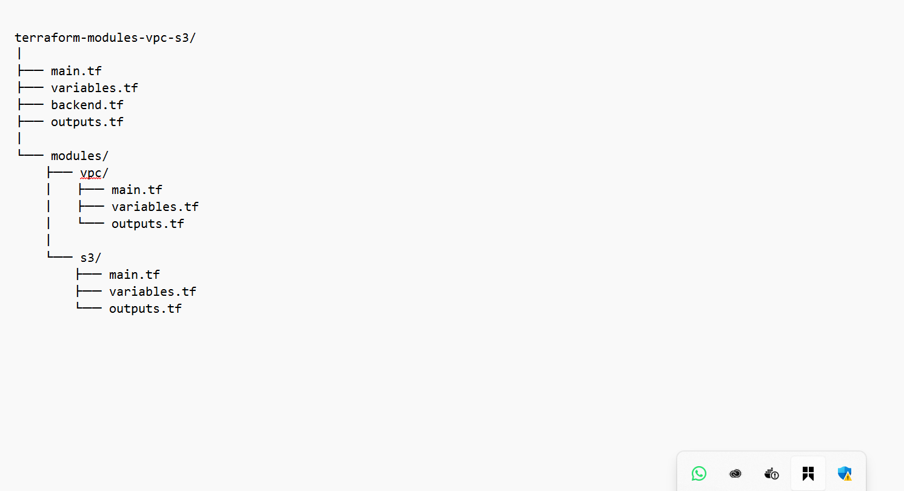

# Mini Project: Terraform Modules - VPC and S3 Bucket with Backend Storage.

### Purpose:

In this mini project, we will use Terraform to create modularized configurations for building an Amazon Virtual Private Cloud (VPC) and an Amazon S3 bucket. Additionally, we will configure Terraform to use Amazon S3 as the backend storage for storing the Terraform state file.

### Objectives:

1. Terraform Modules:

Learn how to create and use Terraform modules for modular infrastructure provisioning.

2. VPC Creation:

Build a reusable Terraform module for creating a VPC with specified configurations.

3. S3 Bucket Creation:

Develop a Terraform module for creating an S3 bucket with customizable settings.

4. Backend Storage Configuration:

Configure Terraform to use Amazon S3 as the backend storage for storing the Terraform state file.

After completing all steps, our directory structure will look like this:

### Project Tasks:

#### Task 1: VPC Module

1. Create a new directory for your Terraform project (e.g., terraform-modules-vpc-s3).

2. Inside the project directory, create a directory for the VPC module (e.g., modules/vpc).

3. Write a Terraform module (modules/vpc/main.tf) for creating a VPC with customizable configurations such as CIDR block, subnets, etc.

4. Create a main Terraform configuration file (main.tf) in the project directory, and use the VPC module to create a VPC.

#### Task 2: S3 Bucket Module

1. Inside the project directory, create a directory for the S3 bucket module (e.g., modules/s3).

2. Write a Terraform module (modules/s3/main.tf) for creating an S3 bucket with customizable configurations such as bucket name, ACL, etc.

3. Modify the main Terraform configuration file (main.tf) to use the S3 module and create an S3 bucket.

#### Task 3: Backend Storage Configuration

1. Configure Terraform to use Amazon S3 as the backend storage for storing the Terraform state file.

2. Create a backend configuration file (e.g., backend.tf) specifying the S3 bucket and key for storing the state.

3. Initialize the Terraform project using the command: terraform init.

4. Apply the Terraform configuration to create the VPC and S3 bucket using the command: terraform apply.

#### Instructions:

1. Create a new directory for your Terraform project using a terminal (mkdir terraform-modules-vpc-s3).

2. Change into the project directory (cd terraform-modules-vpc-s3).

3. Create directories for the VPC and S3 modules (mkdir -p modules/vpc and mkdir -p modules/s3).

4. Write the VPC module configuration (vim modules/vpc/variable.tf) and the S3 module configuration (nano modules/s3/main.tf).

### VPC Module

#### VPC Module Variables

vim modules/vpc/variable.tf

#### VPC Module Resources

vim modules/vpc/main.tf

#### VPC Module Outputs

vim modules/vpc/outputs.tf

This makes the VPC reusable and configurable.

### S3 Bucket Module

#### S3 Module Variables

modules/s3/variables.tf

#### S3 Module Resources

modules/s3/main.tf

#### S3 Module Outputs

modules/s3/outputs.tf

5. Create the main Terraform configuration file (vim main.tf) and use the VPC and S3 modules.

#### Outputs File

6. Create the backend configuration file (nano backend.tf) to specify the backend storage.

### Backend Storage Configuration (Remote State)

#### Prerequisites for Backend

Before running Terraform:

Create an S3 bucket manually (for backend state). Ensure buket name is unique, delete the bucket afterward as the bucket would be created using terraform.

#### Create a DynamoDB table for locking

DynamoDB table requirements:

Table name: terraform-lock-table
Partition key: LockID (String)

#### Backend Configuration

backend.tf

7. Initialize the Terraform project using

terraform init -reconfigure

This was use because of S3 ACL and reconfiguration

terraform validate

terraform plan

8. Apply the Terraform configuration using terraform apply and confirm the creation of the VPC and S3 bucket.

Bucket Created as Specify in terraform:

VCP Created as Specify:

9. Document your observations and any challenges faced during the project.

#### Expected Resources Created

✅ Amazon VPC

✅ Public Subnet

✅ Amazon S3 Bucket

✅ Terraform state stored securely in S3

✅ State locking enabled with DynamoDB

#### Observations & Challenges

✅ Key Learnings

Terraform modules improve reusability and structure.

Remote backend is essential for team environments.

Output variables enable cross-module communication.

#### Challenges

Issue: Bucket name already exists Solution: Use a unique bucket name

Issue: Backend errors Solution: Ensure backend S3 bucket exists

Issue: Locked state Solution: Check DynamoDB table

### Side Note:

Ensure you have the AWS CLI installed and configured with appropriate credentials.

Modify variables and configurations in the modules based on your specific requirements.

Replace placeholder values in the main and backend configuration files with actual values.

This is a learning exercise; use it to gain hands-on experience with Terraform modules and backend storage.

END.

