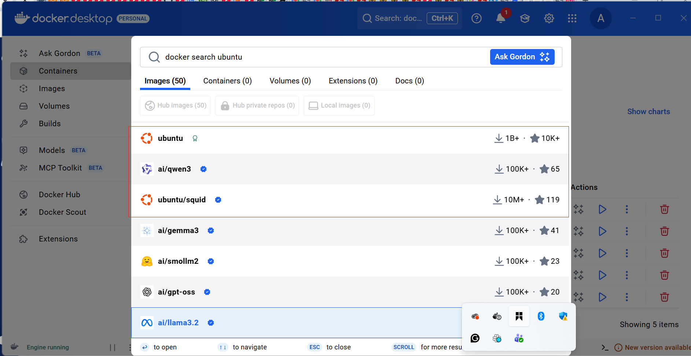
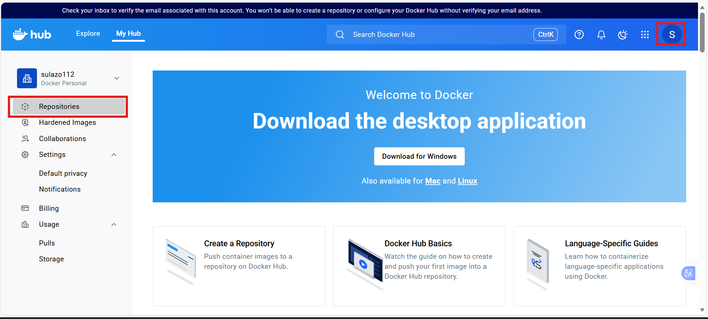

# Working with Docker Images

## Introduction to Docker Images

Docker images are the building blocks of containers. They are lightweight, portable, and self-sufficient packages that contain everything needed to run a software application, including the code, runtime, libraries, and system tools. Images are created from a set of instructions known as a Dockerfile, which specifies the environment and configuration for the application.

### Pulling Images from Docker Hub

Docker Hub (https://hub.docker.com/) is a cloud-based registry that hosts a vast collection of Docker images. We can pull images from Docker Hub to our local machine using the docker pull command.

To explore available images on Docker Hub, the docker command provides a search subcommand. For instance, to find the Ubuntu image, you can execute:

docker search ubuntu

This command allows us to discover and explore various images hosted on Docker Hub by providing relevant search results. In this case, the output will be similar to this:

In the "OFFICIAL" column, the "OK" designation signifies that an image has been constructed and is officially supported by the organization responsible for the project. Once we have identified the desired image, we can retrieve it to our local machine using the "pull" subcommand.

To download the official Ubuntu image to our computer, use the following command:

docker pull ubuntu

Executing this command will fetch the official Ubuntu image from Docker Hub and store it locally on our machine, making it ready for use in creating containers.

Once an image has been successfully downloaded, you can proceed to run a container using that downloaded image by employing the "run" subcommand. Similar to the hello-world example, if an image is not present locally when the docker run subcommand is invoked, Docker will automatically download the required image before initiating the container.

docker run ubuntu

To view the list of images that have been downloaded and are available on your local machine, enter the following command:

docker images

Executing this command provides a comprehensive list of all the images stored locally, allowing us to verify the presence of the downloaded image and gather information about its size, version, and other relevant details.

### Dockerfile

In this dockerfile file, we will be using an nginx image. Nginx is an open source software for web serving, reverse proxying, caching, load balancing, media streaming, and more. It started out as a web server designed for maximum performance and stability. It is recommended we read more on Nginx here. https://www.f5.com/glossary/nginx

To create a Dockerfile, use a text editor of your choice, such as vim or nano. Start by specifying a base image, defining the working directory, copying files, installing dependencies, and configuring the runtime environment.

Here's a simple example of a Dockerfile for a html file: Let's create an image with using a dockerfile. Paste the code snippet below in a file named dockerfile This example assumes you have a basic HTML file named index.html in the same directory as your Dockerfile.

Creating Dockerfile and HTML file

### Explanation of the code snippet above

1. FROM nginx:latest: Specifies the official NGINX base image from Docker Hub.

2. WORKDIR /usr/share/nginx/html/: Specifies the working directory in the container

3. COPY index.html /usr/share/nginx/html/: Copies the local index.html file to the NGINX default public directory, which is where NGINX serves static content from.

4. EXPOSE 80: Informs Docker that the NGINX server will use port 80. This is a documentation feature and doesn't actually publish the port.

5. CMD: NGINX images come with a default CMD to start the server, so there's no need to specify it explicitly.

HTML file named index.html in the same directory as our dockerfile.

echo "Welcome to Darey.io" >> index.html

To build an image from this Dockerfile, navigate to the directory containing the file and run:

docker build -t dockerfile .

Run Docker Image to check the image build

docker images

To run a container based on the custom NGINX image we created with a dockerfile, run the command

docker run -p 8080:80 dockerfile

Running the command above will create a container that listens on port 8080 using the nginx image we created earlier. So we need to create a new rule in security group of the EC2 instance.

i. On our EC2 instance, click on the security tab

ii. Click on edit inbound rules to add new rules. This will allow incoming traffic to instance associated with the security group. Our aim is to allow incoming traffic on port 8080

iii. Click on Add rule to add a new rule

Let see the list of available containers

docker ps -a

The image above show our container is not running yet. We can start it with the command below

docker start CONTAINER_ID

docker ps -a

Now that we have started our container, we can access the content on our web browser with http://publicip_adderss:8082

### Pushing Docker Images To Docker Hub

Let's recall our git project, where we push changes made on our local computer to a remote repository (github) so everyone can track the changes we made and also collaborate on it. Now that we have created a docker images on our own computer, we need to think about how to reuse this image in the future or how do people in other region make use of this image and possibly collaborate on it. This is where Docker Hub comes in. Let's go ahead and push our image to docker hub

i. Create an account on Docker Hub if you don't have one.

ii. Create a repository on docker hub

iii. Tag Your Docker Image Before pushing, ensure that your Docker image is appropriately tagged. You typically tag your image with your Docker Hub username and the repository name.

docker tag <your-image-name> <your-dockerhub-username>/<your-repository-name>:<tag>

docker tag dockerfile sulazo112/suleimandocker docker tag darey-nginx sulazo112/suleimandocker:latest

iv. Login to Docker hub

docker login -u <your-docker-hub-username> docker login -u sulazo112

Running the command above will prompt you for a password. Authenticate using your docker hub password

v. Push our image to docker hub

docker push <your-dockerhub-username>/<your-repository-name>:<tag>

docker push sulazo112/suleimandocker docker push sulazo112/suleimandocker:latest

vi. Verify the image is in your docker hub repository

Now anyone can make use of the image we have on our docker hub repository.

### Completed Task Dockerize a Basic Web Static Page

1. Launch an instance and create a Dockerfile:

Launch an ubuntu EC2 instance and connect to it
Create a dockerfile, in the file;
Use the official nginx image as the base.
Copy your web static page file (e.g. a html file) to the appropriate location within the container.
Expose the port your web application runs on (e.g., 80).

2. Build the Docker Image:

Navigate to the directory containing your Dockerfile if not there
Build the image using the dockerfile

3. Run the Docker Container:

Once the image is built, run a container using the built image

4. Verify in Browser:

Open a web browser and navigate to http://public-ip:8080 (or the port you specified in the docker run command).
Confirm that your web application is running successfully.
Tips:

Ensure your web static page is accessible on the specified port within the container. Use clear and concise names for your Docker image and container. Provide comments in your Dockerfile to explain each step for better understanding.

End.

