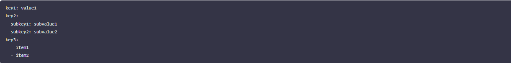
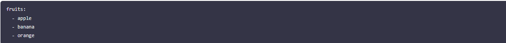

# Working with Kubernetes Resources

## Introduction To YAML

A Kubernetes YAML file is a text file written in YAML syntax that describes and defines Kubernetes resources. YAML is a human-readable data serialization format that is commonly used for configuration files. In the context of Kubernetes, these YAML files serve as a declarative way to specify the desired state of the resources such as pods, container, service and deployment you want to deploy and manage within a Kubernetes cluster.

### Basic Structure Of YAML File

YAML uses indentation to represent the hierarchy of data, and it uses whitespace (usually spaces, not tabs) for indentation.

### Data Types

Scalars Scalars are single values.

Strings:

name: Akinwale Idowu

Numbers:

age: 20

Booleans:

is_student: true

#### Collections

Lists (arrays):

Maps (key-value pairs):

Nested Structures YAML allows nesting of structures:

Comments

In YAML, comments starts with #:

Multiline Strings

Multiline strings can be represented using the | or > characters:

Anchors and Aliases

We can use & to create an anchor and * to create an alias:

In this example, second has the same value as first.

Now that we'ev got the basics, practice writing and reading YAML to become comfortable with its syntax. It's widely used in configuration files for various tools and systems.

### Deploying Applications in Kubernetes

In Kubernetes, deploying applications is a fundamental skill that every beginner needs to grasp. Deployment involves the process of taking our application code and running it on a Kubernetes cluster, ensuring that it scales, manages resources efficiently, and stays resilient. This hands-on project will guide us through deploying our first application using Minikube, a lightweight, single-node Kubernetes cluster perfect for beginners.

### Deployments in Kubernetes:

In Kubernetes, a Deployment is a declarative approach to managing and scaling applications. It provides a blueprint for the desired state of our application, allowing Kubernetes to handle the complexities of deploying and managing replicas. Whether you're running a simple web server or a more complex microservices architecture, Deployments are the cornerstone for maintaining application consistency and availability.

#### Services in Kubernetes:

Once our application is deployed, it needs a way to be accessed by other parts of our system or external users. This is where Services come into play. In Kubernetes, a Service is an abstraction that defines a logical set of Pods and a policy by which to access them. It acts as a stable endpoint to connect to our application, allowing for easy communication within the cluster or from external sources. Some of the several types of Services in Kubernetes;

ClusterIP: Purpose: The default type. Exposes the Service on a cluster-internal IP. Accessible only within the cluster.

NodePort: Exposes the Service on each Node's IP at a static port (NodePort). Accessible externally using NodeIP.

LoadBalancer: Exposes the Service externally using a cloud provider's load balancer. Accessible externally through the load balancer's IP.

In subsequent sections, we will dive deep into deployment strategies and service configurations within the Kubernetes ecosystem, delving into the intricacies of these components to ensure a thorough understanding and proficiency in their utilization.

### Deploying a Minikube Sample Application

Using YAML files for deployments and services in Kubernetes is like crafting a detailed plan for our application, while direct deployment with kubectl commands is more like giving quick, on-the-spot instructions to launch and manage your application. Let's create a minikube deployment and service with kubectl.

kubectl create deployment hello-minikube --image=kicbase/echo-server:1.0

The command above creates a Kubernetes Deployment named "hello-minikube" running the "kicbase/echo-server:1.0" container image

if the code return error, start Minikube using:

minikube start --driver=docker.

kubectl expose deployment hello-minikube --type=NodePort --port=8080

The command above exposes the Kubernetes Deployment named "hello-minikube" as a NodePort service on port 8080

kubectl get services hello-minikube

The easiest way to access this service is to let minikube launch a web browser for you.

minikube service hello-minikube

### Working With YAML Files

Let's recall our docker foundations project when we pushed an image we built to docker hub. Now let reuse our image in our yaml script for deployment.

i. Create a new folder my-nginx-yaml

ii. Create a new file nginx-deployment.yaml and paste the content below

notepad nginx-deployment.yaml

The provided YAML snippet defines a Kubernetes Deployment for deploying an instance of the Nginx web server. Let's break down the key components:

apiVersion: apps/v1: Specifies the Kubernetes API version for the object being created, in this case, a Deployment in the "apps" group.

kind: Deployment: Defines the type of Kubernetes resource being created, which is a Deployment. Deployments are used to manage the deployment and scaling of applications.

metadata: Contains metadata for the Deployment, including the name of the Deployment, which is set to "my-nginx-deployment."

spec: Describes the desired state of the Deployment.

replicas: 1: Specifies that the desired number of replicas (instances) of the Pods controlled by this Deployment is 1.

selector: Defines how the Deployment selects which Pods to manage. In this case, it uses the label "app: my-nginx" to match Pods.

template: Specifies the template for creating new Pods.

metadata: Contains labels for the Pods, and in this case, the label is set to "app: my-nginx."

spec: Describes the Pod specification.

containers: Defines the containers within the Pod.

name: my-nginx: Sets the name of the container to "my-nginx."

image: akinwale/my-nginx:1.0: Specifies the Docker image to be used for the Nginx container. The image is "akinwale/my-nginx" with version "1.0."

Note you can replace the image with your own image

ports: Specifies the port mapping for the container, and in this case, it exposes port 80.

iii. Create a new file called nginx-service.yaml and paste the content below

The provided YAML snippet defines a Kubernetes Deployment for deploying an instance of the Nginx web server. Let's break down the key components:

apiVersion: apps/v1: Specifies the Kubernetes API version for the object being created, in this case, a Deployment in the "apps" group.

kind: Deployment: Defines the type of Kubernetes resource being created, which is a Deployment. Deployments are used to manage the deployment and scaling of applications.

metadata: Contains metadata for the Deployment, including the name of the Deployment, which is set to "my-nginx-deployment."

spec: Describes the desired state of the Deployment.

replicas: 1: Specifies that the desired number of replicas (instances) of the Pods controlled by this Deployment is 1.

selector: Defines how the Deployment selects which Pods to manage. In this case, it uses the label "app: my-nginx" to match Pods.

template: Specifies the template for creating new Pods.

metadata: Contains labels for the Pods, and in this case, the label is set to "app: my-nginx."

spec: Describes the Pod specification.

containers: Defines the containers within the Pod.

name: my-nginx: Sets the name of the container to "my-nginx."

image: akinwale/my-nginx:1.0: Specifies the Docker image to be used for the Nginx container. The image is "akinwale/my-nginx" with version "1.0."

Note you can replace the image with your own image

ports: Specifies the port mapping for the container, and in this case, it exposes port 80.

iii. Create a new file called nginx-service.yaml and paste the content below

The provided YAML snippet defines a Kubernetes Service for exposing the Nginx application to the external world. Let's break down the key components:

apiVersion: v1: Specifies the Kubernetes API version for the object being created, in this case, a Service.

kind: Service: Defines the type of Kubernetes resource being created, which is a Service. Services provide a stable endpoint for accessing a set of Pods.

metadata: Contains metadata for the Service, including the name of the Service, which is set to "my-nginx-service."

spec: Describes the desired state of the Service.

selector: Specifies the labels used to select which Pods the Service will route traffic to. In this case, it selects Pods with the label "app: my-nginx."

ports: Specifies the ports configuration for the Service.

protocol: TCP:* Specifies the transport layer protocol, which is TCP in this case.

port: 80: Defines the port on which the Service will be exposed.

targetPort: 80: Specifies the port on the Pods to which the traffic will be forwarded.

type: NodePort: Sets the type of the Service to NodePort. This means that the Service will be accessible externally on each Node's IP address at a static port, which will be automatically assigned unless specified.

iv. Run the command below for the deployment on the cluster

kubectl apply -f nginx-deployment.yaml

kubectl apply -f nginx-service.yaml

First cd into the folder the the YAML file was created.

v. Verify your deployment

kubectl get deployments

kubectl get services

vi. Access your deployment on web browser

minikube service my-nginx-service --url

Project End.