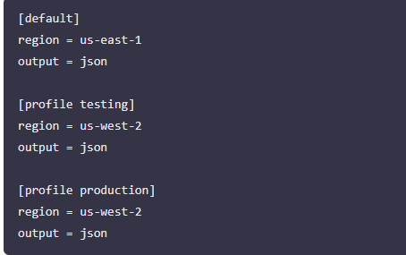

# Mini Project - Working with Functions

In this mini-project, we will focus on some other essential concepts in shell scripting.

Remeber the overall goal is to develop a shell script for one of DataWise Solutions's clients, that automates the setup of EC2 instances and S3 buckets. Part of the critical elements we will be focusing on in this project is Functions.

## Functions

Organizing our code is key to maintaining clarity and efficiency. One powerful technique for achieving this is through the use of functions.

By encapsulating specific logic within functions, we can streamline our scripts and improve readability. Going forward, I will be creating functions for every piece of requirement we wish to satisfy.

Lets consider the following logic and encapsulate them in functions

Check if script has an argument
Check if AWS CLI is installed
Check if environment variable exists to authenticate to AWS
To create a function in a shell script, we simply have to define it using the following syntax:

function_name() {"\n    # Function body\n    # You can place any commands or logic here\n"} 

Here's a breakdown of the syntax:

function_name: This is the name of our function. Choose a descriptive name that reflects the purpose of the function.
(): Parentheses are used to define the function. They can be omitted in simpler cases, but it's good practice to include them for clarity.
{} Curly braces enclose the body of the function, where we define the commands or logic that the function will execute.

### Function: Check if script has an argument

Lets take the same code in previous mini-project and encapsulate it in a function.

Here is the code below without a function.

It would look like this with a function called check_num_of_args

When a function is defined in a shell script, it remains inactive until it is invoked or called within the script. To execute the code within the function, we must place a call to the function in a relevant part of our script.

It's crucial to consider the order in which the interpreter evaluates each line of code. Placing the function where it logically fits within the flow of our script ensures that it is available and ready to be executed when needed. This organization helps maintain the readability and coherence of our script, making it easier to understand and debug.

Lets see what that would now look like;

With a refactored version of the code, we now have the flow like this;

Environment variable moved to the top
Function defined
Function call
Activate based on infrastructure environment section.
What we could also do is encapsulate number 4 in a function and call all the functions at the end of the script. This is what we would see most times in the real world.

Lets see what that would now look like.

With the updated version of the code, we can now see how clean the code looks. we can easily understand what each function is doing based on its name, comments, and the order in which the functions are called at the end.

## Check if AWS CLI is installed

Lets break down this section of the code;

if ! command -v aws &> /dev/null; then: This line contains an if statement. Here's the breakdown:

!: This is the logical negation operator. It reverses the result of a command, so ! command means "if Not".
command -v aws: This command checks if the aws command is available in the system. It returns the path to the aws executable if it exists, or nothing if it doesn't. if you run this on your system, it will tell you the path to the aws cli that you installed previously.

Hence, the "command -v" utility also returns the same thing that the "which" command returns. With the "!" operator, we are saying that if the path for "aws" does not exist, then return 1

/dev/null: This part redirects both standard output (stdout) and standard error (stderr) to /dev/null, a special device file that discards all output. This effectively suppresses any output from the command -v command.
then: This keyword indicates the beginning of the code block to execute if the condition in the if statement is true.
echo "AWS CLI is not installed. Please install it before proceeding.": This line prints an error message to the standard output if the AWS CLI is not installed.
return 1: This line causes the function to exit with a non-zero exit status (1). A non-zero exit status conventionally indicates an error condition in Unix-like systems.

## Check if environment variable exists to authenticate to AWS

To programmatically create resources in AWS, we need to configure authentication using various means such as environment variables, configuration files, or IAM roles.

The ~/.aws/credentials and ~/.aws/config files are commonly used to store AWS credentials and configuration settings, respectively.

Running the aws configure command we ran earlier creates these files. we can use the cat command to open them and see the content.

Credentials File (~/.aws/credentials)

The credentials file typically contains AWS access key ID and secret access key pairs. You will have only default section at first. But you can add other environments as required. Just as we have for testing and production below.

It is formatted as follows:

### Config File (~/.aws/config)

The config file stores configuration settings for AWS services and clients. It can include settings such as the default region, output format, and profiles. An example config file might look like this:

A profile will enable you to easily switch between different AWS configurations. If we set an environment variable by running the command export AWS_PROFILE=testing - this will pick up the configuration from both file and authenticate you to the testing environment.

AWS Profile The AWS_PROFILE environment variable allows users to specify which profile to use from their AWS config and credentials files. If AWS_PROFILE is not set, the default profile is used.

Here is what the function would look like;

The -z flag is used to test if the value of the string variable (in this case, the value stored in the $AWS_PROFILE variable) has zero length, meaning it is empty or null.

Our shell script will now look like this

### Summary:

In this mini-project, I learned how to organize shell scripts more effectively using functions to encapsulate logic, improve readability, and maintain cleaner code. We refactored a script that checks for an environment argument by moving logic into functions (check_num_of_args and activate_infra_environment), making the flow easier to follow and maintain. We also introduced additional functions to handle essential checks for automation: ensuring the AWS CLI is installed (check_aws_cli) and verifying that the AWS profile environment variable is set (check_aws_profile) for authentication. By defining, then calling functions at the end of the script, we created a structured, modular, and professional script suitable for real-world use cases like automating EC2 and S3 setup.

End.